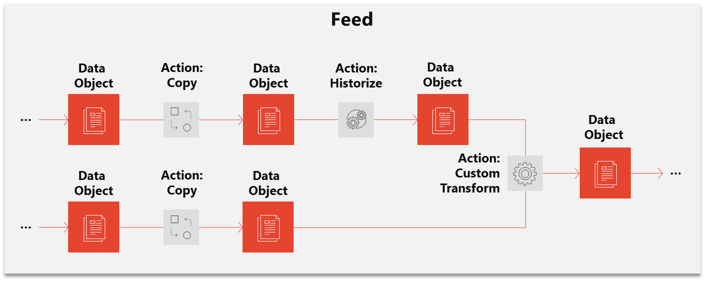

# Smart Data Lake

 
Smart Data Lake Builder is a data lake automation framework that makes loading and transforming data a breeze. 
It is implemented in Scala and builds on top of open-source big data technologies like [Apache Hadoop](https://hadoop.apache.org/) and [Apache Spark](https://spark.apache.org/), including connectors for diverse data sources (HadoopFS, Hive, DeltaLake, JDBC, Splunk,  Webservice, SFTP, JMS, Excel, Access) and file formats.

### A Data Lake
* is a central raw data store for analytics
* facilitates cheap raw storage to handle growing volumes of data
* enables topnotch artificial intelligence (AI) and machine learning (ML) technologies for data-driven enterprises

### The Smart Data Lake adds
* a layered data architecture to provide not only raw data, but prepared, secured, high quality data according to business entities, ready to use for analytical use cases, also called «Smart Data»
* a declarative, configuration-driven approach to creating data pipelines. Metadata about data pipelines allows for efficient operations, maintenance and more business self-service.

### Benefits of Smart Data Lake Builder
* Cheaper implementation of data lakes
* Increased productivity of data scientists
* Higher level of self-service
* Decreased operations and maintenance costs
* Fully open source, no vendor lock-in

### When should you consider using Smart Data Lake Builder ?
Some common use cases include:
* Building Data Lakes, drastically increasing productivity and usability 
* Data Apps - building complex data processing apps
* DWH automation - reading and writing to relational databases via SQL 
* Data migration - Efficiently create one-time data pipelines
* Data Catalog / Data Lineage - Generated automatically from metadata 

See [Features](docs/Features.md) for a comprehensive list of Smart Data Lake Builder features.

## How it works
The following diagram shows the core concepts:

### Data object
A data object defines the location and format of data. 
Some data objects require a connection to access remote data (e.g. a database connection).

### Action
The "data processors" are called actions. 
An action requires at least one input and output data object. 
An action reads the data from the input data object, processes and writes it to the output data object. 
Many actions are predefined e.g. transform data from json to csv but you can also define your custom transformer action.

### Feed
Actions connect different Data Object and implicitly define a directed acyclic graph, as they model the dependencies needed to fill a Data Object.
This automatically generated, arbitrary complex data flow can be divided up into Feed's (subgraphs) for execution and monitoring.

### Configuration
All metadata i.e. connections, data objects and actions are defined in a central configuration file, usually called application.conf.
The file format used is [HOCON](https://github.com/lightbend/config/blob/master/HOCON.md) which makes it easy to edit.

### Getting Started
To see how all this works in action, head over to the [Getting Started](docs/GettingStarted.md) page.

# Major Contributors
  
[www.sbb.ch](http://www.sbb.ch) : Provided the previously developed software as a foundation for the open source project   

  
[www.elca.ch](http://www.elca.ch) : Did the comprehensive revision and provision as open source project 

# Additional Documentation
[Getting Started](docs/GettingStarted.md)  
[Reference](docs/Reference.md)  
[Architecture](docs/Architecture.md)  
[Testing](docs/Testing.md)  
[Glossary](docs/Glossary.md)  
[Troubleshooting](docs/Troubleshooting.md)    
[FAQ](docs/FAQ.md)  
[Contributing](docs/Contribute.md)  
[Running in the Public Cloud](docs/PublicCloud.md)  
