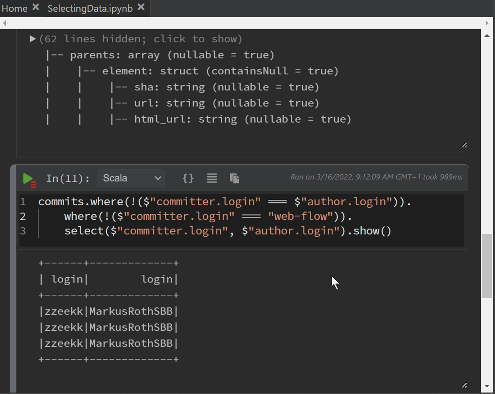

This article presents the deployment of an [Airbyte Connector](airbyte.com) with Smart Data Lake Builder (SDLB). 
In particular the [github connector](https://docs.airbyte.com/integrations/sources/github) is implemented using the python sources.

<!--truncate-->

Airbyte is a framework to sync data from a variety of sources (APIs and databases) into warehouses and lakes. 
In this example an Airbyte connector is utilized to stream data into Smart Data Lake (SDL). 
Therefore, the [Airbyte dataObject](http://smartdatalake.ch/json-schema-viewer/index.html#viewer-page?v=2-2) is used and will be configured. 
The general [Airbyte connector handling](https://docs.airbyte.com/understanding-airbyte/airbyte-specification#source) is implemented in SDL, which includes the 4 main steps:
* `spec`: receiving the specification of the connector
* `check`: validating the specified configuration
* `discover`: gather a catalog of available streams and its schemas
* `read`: collect the actual data

The actual connector is not provided in the SDL repository and need to be obtained from the [Airbyte repository](https://github.com/airbytehq/airbyte). Beside the [list of existing connectors](https://docs.airbyte.com/integrations), custom connectors could be implemented in Python or Javascript. 

The following description builds on top of the example setup from the [getting-started](../../docs/getting-started/setup) guide, using [Podman](docs.podman.io) as container engine within a [WSL](https://docs.microsoft.com/en-us/windows/wsl/install) Ubuntu image. 

The [github connector](https://docs.airbyte.com/integrations/sources/github) is utilized to gather data about a specific repository.

## Prerequisites
After downloading and installing all necessary packages, the connector is briefly tested:
* Python
* [Podman including `podman-compose`](../../docs/getting-started/troubleshooting/docker-on-windows) or [Docker](https://www.docker.com/get-started)
* [SDL example](https://github.com/smart-data-lake/getting-started/archive/refs/heads/master.zip), download and unpack: 
  ```Bash
  git clone https://github.com/smart-data-lake/getting-started.git SDL_airbyte
  cd SDL_airbyte
  ```
* download the [Airbyte repository](https://github.com/airbytehq/airbyte) 
  ```Bash
  git clone https://github.com/airbytehq/airbyte.git
  ```
  Alternatively, only the target connector can be downloaded:
  ```Bash
  svn checkout https://github.com/airbytehq/airbyte/trunk/airbyte-integrations/connectors/source-github
  ```
  Here the Airbyte `airbyte/airbyte-integrations/connectors/source-github/` directory is copied into the `SDL_airbyte` directory for handy calling the connector.

## [Optional] Inspect the connector specification
The first connector command `spec` provides the connector specification. This is the basis to create a connector configuration. To run the connector as is, the Python `airbyte-cdk` package needs to be installed and the connector can be launched:

* Install Python airbyte-cdk: `pip install airbyte_cdk`
* try the connector: 
  ```Bash
  cd SDL_airbyte
  python source_github/main.py spec | python -m json.tool
  ```
  This provides a [JSON string](github_spec_out.json) with the connector specification. The fields listed under `properties` are relevant for the configuration (compare with the configuration later used). 

## Configuration
To launch Smart Data Lake Builder (SDLB) with the Airbyte connector the following needs to be modified:

* add the Airbyte ***dataObject*** with its configuration to the `config/application.conf`:
  ```Python
  dataObjects {
    ext-commits {
      type = AirbyteDataObject
      config = {
        "credentials": {
          "personal_access_token": "<yourPersonalAccessToken>" ### enter your personal access token here
        },
        "repository": "smart-data-lake/smart-data-lake",
        "start_date": "2021-02-01T00:00:00Z",
        "branch": "documentation develop-spark3 develop-spark2",
        "page_size_for_large_streams": 100
      },
      streamName = "commits",
      cmd = {
        type = CmdScript
        name = "airbyte_connector_github"
        linuxCmd = "python3 /mnt/source-github/main.py"
      }
    }
  ...
    stg-commits {
     type = DeltaLakeTableDataObject
     path = "~{id}"
     table {
      db = "default"
      name = "stg_commits"
      primaryKey = [created_at]
      }
    }
  ```
  The `ext-commits` defined connector settings. 
  While the `config` varies from connector to connector, the remaining fields are SDL specific. 
  The `streamName` selects the stream, exactly one. 
  If multiple streams should be collected, multiple dataObjects need to be defined. 
  In `linuxCmd` the actual connector script is called. 
  In our case we will mount the connector directory into the SDL container. 

* also add the definition of the data stream ***action*** to pipe the coming data stream into a `DeltaLakeTableDataObject`:
  ```Bash
    actions {
      download-commits {
        type = CopyAction
        inputId = ext-commits
        outputId = stg-commits
        metadata {
          feed = download
        }
      }
  ...
  ```
* Since Airbyte will be called as Python script in the sdl container, we need to (re-)build the container with Python support and the Python `airbyte-cdk` package. 
  Therefore, in the Dockerfile we add:
	```
	RUN \
  apt update && \
  apt --assume-yes install python3 python3-pip && \
  pip3 install airbyte-cdk~=0.1.25
  ```
  and rebuild 
  ```Bash
  podman build . -t sdl-spark
  ```

Now we are ready to go. My full [SDLB config file](application.conf) additionally includes the pull-request stream.

## Run and inspect results
Since the data will be streamed into a `DeltaLakeTableDataObject` the metastore container is necessary. Further we aim to inspect the data using the Polynote notebook. Thus, first these containers are launched using (in the SDL example base directory):
```Bash
podman-compose up
podman pod ls
```
With the second command we can verify the pod name and both running containers in it (should be three including the infra container).

Then, the SDLB can be launched using the additional option to mount the Airbyte connector directory:
```Bash
podman run --hostname localhost --rm --pod sdl_airbyte -v ${PWD}/source-github/:/mnt/source-github -v ${PWD}/data:/mnt/data -v ${PWD}/target:/mnt/lib -v ${PWD}/config:/mnt/config sdl-spark:latest --config /mnt/config --feed-sel download
```

The output presents the successful run of the workflow:
```Bash
2022-03-16 07:54:03 INFO  ActionDAGRun$ActionEventListener - Action~download-commits[CopyAction]: Exec succeeded [dag-1-80]
2022-03-16 07:54:03 INFO  ActionDAGRun$ - exec SUCCEEDED for dag 1:
                 ┌─────┐
                 │start│
                 └───┬─┘
                     │
                     v
 ┌───────────────────────────────────────┐
 │download-commits SUCCEEDED PT11.686865S│
 └───────────────────────────────────────┘
     [main]
2022-03-16 07:54:03 INFO  LocalSmartDataLakeBuilder$ - LocalSmartDataLakeBuilder finished successfully: SUCCEEDED=1 [main]
2022-03-16 07:54:03 INFO  SparkUI - Stopped Spark web UI at http://localhost:4040 [shutdown-hook-0]
```

Launching Polynote `localhost:8192` in the browser, we can inspect data and develop further workflows. Here an example, where the commits are listed, which were committed in the name of someone else, excluding the web-flow. See [Polynote Notebook](SelectingData.ipynb)


## Summary

The Airbyte connectors provide an easy access to a variety of data sources. The connectors can be utilized in SDLB with a few settings. Thus this maybe a handy solution for access even complex interfaces.  