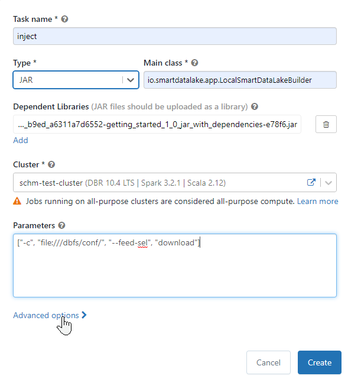
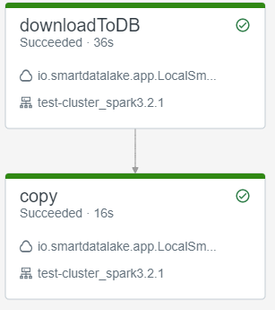
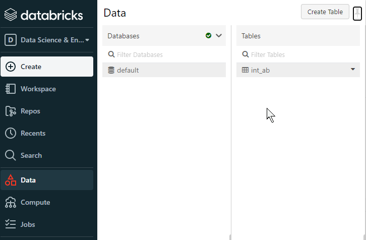
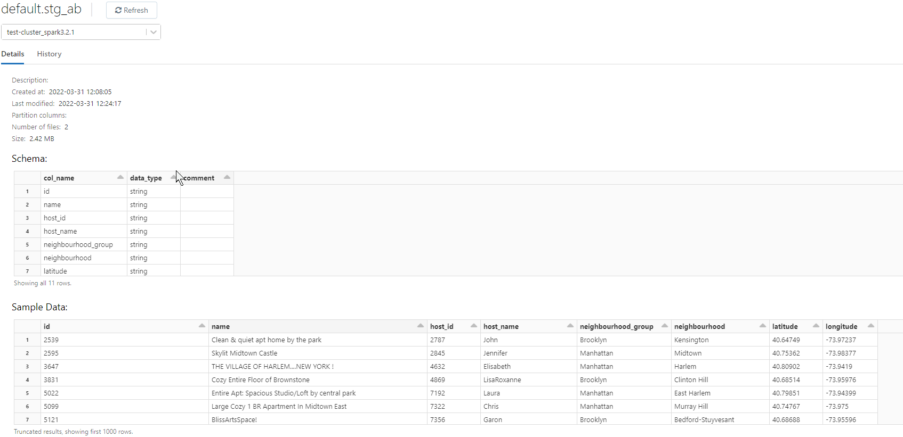

Many analytics applications are ported to the cloud, Data Lakes and Lakehouses in the cloud becoming more and more popular. The [Databricks](https://databricks.com) platform provides an easy accessible and easy configurable. SmartDataLake Builder on the other hand provides an open source, portable automation tool to load and transform the data.

In this article the deployment of SmartDataLakeBuilder (SDLB) on [Databricks](https://databricks.com) is described. 

<!--truncate-->

Before jumping in, it should be mentioned, that there are also many other methods to deploy SDLB in the cloud, e.g. using containers on Azure, Azure Kubernetes Service, Azure Synapse Clusters, ...
The present method provides the advantage of **not** needing to deal with the storage and all related configurations, by using Databricks. 
Further, the presented SDLB pipeline is just a simple example, focusing on the implementation into Databricks environment. SDLB provide a wide range of features and its full power is not revealed here. 

Let's get started:

1. [**Databricks**](https://databricks.com) accounts can be created as [Free Trial](https://databricks.com/try-databricks?itm_data=Homepage-HeroCTA-Trial) or as [Community Account](https://community.databricks.com/s/login/SelfRegister)
    - Account and Workspace creation are described in detail [here](https://docs.databricks.com/getting-started/account-setup.html), there are few hints and modifications presented below.
    - I selected AWS backend, but there are conceptual no differences to the other providers. If you already have an Azure, AWS or Google Cloud account/subscription this can be used, otherwise you can register a trial subscription there. 
1. **Workspace stack** is created using the Quickstart as described in the documentation. When finished launch the Workspace.
1. **Databricks CLI**: for file transfer of configuration files, scripts and data, the [Databricks CLI](https://docs.databricks.com/dev-tools/cli/index.html) is installed locally. **Configure** the CLI, using the Workspace URL and in the Workspace "Settings" -> "User Settings" -> "Access tokens" create a new token.
1. **Cluster** creation, in the Workspace open the *Cluster* Creation form.
	- Spark version: When selecting the *Databricks version* pay attention to the related Spark version. 
	  This need to match with the Spark version we build SDLB later. Here `10.4 TLS` is selected with `Spark 3.2.1` and `Scala 2.12`. 
	  Alternatively, SDLB can be build with a different Spark versions, see also [Architecture](../../docs/architecture) for supported versions. 
	- typesafe library version correction script: the workspace currently includes version 1.2.1 from com.typesafe:config java library. 
	  SDLB relies on functions of a newer version (>1.3.0) of this library. 
	  Thus, we provide a newer version of the com.typesafe:config java library in an initialization script: *Advanced options* -> *Init Scripts* specify `dbfs:/databricks/scripts/config-install.sh`
		+ Further, the script need to be created and uploaded. I used the following commands in local Terminal:
		```
		cat << EOF >> ./config-install.sh
		#!/bin/bash
		wget -O /databricks/jars/-----config-1.4.1.jar https://repo1.maven.org/maven2/com/typesafe/config/1.4.1/config-1.4.1.jar
		EOF
		databricks fs mkdirs dbfs:/databricks/scripts
		databricks fs cp ./config-install.sh dbfs:/databricks/scripts/
		```
		Note: to double check the typesafe version I ran `grep typesafe pom.xml` in the [SmartDataLake](https://github.com/smart-data-lake/smart-data-lake.git) source

		Note: the added `-----` will verify that this `.jar` is preferred before the default Workspace Spark version (which starts with `----`). 
		If you are curious you could double check e.g. with a Workspace Python Notebook running `!ls /databricks/jars/*config*`

1. **fat-jar**:
       We need to provide the SDLB sources and all required libraries. Therefore, we compile and pack the Scala code into a Jar including the dependencies. We use the [getting-started](https://github.com/smart-data-lake/getting-started.git) as dummy project, which itself pulls the SDLB sources. 
	- download the [getting-started](https://github.com/smart-data-lake/getting-started.git) source and build it with the `-P fat-jar` profile
	```
    podman run -v ${PWD}:/mnt/project -v ${PWD}/.mvnrepo:/mnt/.mvnrepo maven:3.6.0-jdk-11-slim -- mvn -DskipTests  -P fat-jar  -f /mnt/project/pom.xml "-Dmaven.repo.local=/mnt/.mvnrepo" package
	```
	General build instructions can be found in the [getting-started](../../docs/getting-started/setup#compile-scala-classes) documentation. 
	Therewith, the file `target/getting-started-1.0-jar-with-dependencies.jar` is created. 
	The *fat-jar* profile will include all required dependencies. The profile is defined in the [smart-data-lake](https://github.com/smart-data-lake/smart-data-lake) pom.xml

1. upload files
	- JAR: in the "Workspace" -> your user -> create a directory `jars` and "import" the library using the link in "(To import a library, such as a jar or egg, click here)" and select the above created fat-jar to upload. As a result the jar will be listed in the Workspace directory. 
	- **SDLB application**: As an example a dataset from Airbnb NYC will be downloaded from Github, first written into a CSV file and later partially ported into a table. Therefore, the pipeline is defined first locally in a new file `application.conf`:
	```
	dataObjects {
	  ext-ab-csv-web {
	    type = WebserviceFileDataObject
	    url = "https://raw.githubusercontent.com/adishourya/Airbnb/master/new-york-city-airbnb-open-data/AB_NYC_2019.csv"
	    followRedirects = true
	    readTimeoutMs=200000
	  }
	  stg-ab {
	    type = CsvFileDataObject
	    path = "file:///dbfs/data/~{id}"
	  }
	  int-ab {
	    type = DeltaLakeTableDataObject
	    path = "~{id}"
	    table {
	      db = "default"
	      name = "stg_ab"
	      primaryKey = [id]
	    }
	  }
	}

	actions {
	  loadWeb2Csv {
	    type = FileTransferAction
	    inputId = ext-ab-csv-web
	    outputId = stg-ab
	    metadata {
	      feed = download
	    }
	  }
	  loadCsvLoc2Db {
	    type = CopyAction
	    inputId = stg-ab
	    outputId = int-ab
	    transformers = [{
	      type = SQLDfTransformer
	      code = "select id, name, host_id,host_name,neighbourhood_group,neighbourhood,latitude,longitude from stg_ab"
	    }]
	    metadata {
	      feed = copy
	    }
	  }
	}
	```
	- upload using Databricks CLI 
	```
	databricks fs mkdirs dbfs:/conf/
	databricks fs cp application.conf dbfs:/conf/application.conf
	```

1. **Job creation**:
	Here, we did not want to specify the schema of the file, thus two job tasks are necessary, to automatically infer and validate the data scheme. The first job task downloads the data into a CSV file. The second one selects columns and stores data into the database. 
	Each job step could perform multiple SDLB actions, here we have one action per job step.
	Define the "download" task by *Jobs* -> *Create Job*: 
	- **Type**: `JAR`
	- **Main Class**: `io.smartdatalake.app.LocalSmartDataLakeBuilder`
	- **add** *Dependent Libraries*: "Workspace" -> select the file previously uploaded "getting-started..." file in the "jars" directory
	
	- **Cluster** select the cluster created above with the corrected typesafe library
	- **Parameters**: `["-c", "file:///dbfs/conf/", "--feed-sel", "download"]`, which specifies the location of the SDLB configuration and selects the feed "download"
	

	Add a second job task (after creation, click the plus below) for the "copy" feed using the same specifications, but parameters `["-c", "file:///dbfs/conf/", "--feed-sel", "copy"]`
	

1. **Launch** the job: 
	When finished in the "Runs" in that job you should see the successful run status
	 

1. **Results**
	After running the SDLB pipeline the data should be downloaded into the staging file and selected parts into the database:
	- csv file: in the first step we downloaded the CSV file. This can be verified, e.g. by inspecting the data directory in the Databricks CLI using `databricks fs ls dbfs:/data/stg-ab` or running in a Workspace Python notebook `!ls /dbfs/data/stg-ab`
	- database: in the second phase specific columns are put into the database. This can be verified in the Workspace -> Data -> default -> stg_ab
	
	

## Lessons Learned
There are a few steps necessary, including building and uploading SDB. Further, we need to be careful with the used versions of the underlying libraries. With these few steps we can reveal the power of SDLB and Databricks, creating a portable and reproducible pipeline into a Databricks Lakehouse.  
