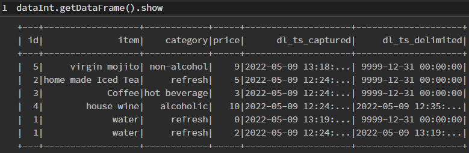

In many cases data has a now constant live. New data points are created, values changed and often data also expires. We are interested in keeping track of all these changes.

<!--truncate-->

In the [getting-started -> part2 -> keeping historical data](../../docs/getting-started/part-2/historical-data.md) historization is already introduced briefly. Here we go in slightly more detail and track data originating from an SQL database. For the sake of simplicity, SDL and SQL server gets deployed in containers using Podman. 

Here we model a typical setup for a workflow from a (MS)SQL database to the Data Lake. Therefore, a the following steps will be performed:

* starting a MS SQL server
* creating a simple dummy table
* copying the table into the data lake
* modifying the data
* re-copy / update the data in the data lake

As data store the metastore container will be utilized. Further, the data changes in the data lake will be monitored using a Polynote notebook.

## Prerequisites

* Podman installation
* SDLB with metastore and Polynote by cloning the getting-started example: 
  ```
  git clone https://github.com/smart-data-lake/getting-started.git SDL_sql
	cd SDL_sql
	unzip part2.additional-files.zip
  ```
* Utilizing JDBC to MS SQL server, SDL required this additional dependency. Therefore, add the following dependency to the `pom.xml`:
	```
	<dependency>
		<groupId>com.microsoft.sqlserver</groupId>
		<artifactId>mssql-jdbc</artifactId>
		<version>10.2.0.jre11</version>
	</dependency>
	```
* build sdl-spark: `podman build -t sdl-spark .`
* build the SDL objects: 
	```
	mkdir .mvnrepo
	podman run -v ${PWD}:/mnt/project -v ${PWD}/.mvnrepo:/mnt/.mvnrepo maven:3.6.0-jdk-11-slim -- mvn -f /mnt/project/pom.xml "-Dmaven.repo.local=/mnt/.mvnrepo" package
	```
* copy polynote notebook [sql_data_monitor.ipynb](sql_data_monitor.ipynb) for later inspection into the `polynote/notebook` directory
* copy the SQL database initialization script [db_init.sql](sql_data_monitor.ipynb) and modification scripts [db_mod.sql](db_mod.sql) into the `config` directory
* start the pod with the metastore and the polynote container: `podman-compose up`

## Prepare Source Database
* start the MS SQL server: 
  ```
  podman run -d --pod sdl_sql --hostname mssqlserver --add-host mssqlserver:127.0.0.1 --name mssql -v ${PWD}/data:/data  -v ${PWD}/config:/config -e "ACCEPT_EULA=Y" -e "SA_PASSWORD=%abcd1234%" mcr.microsoft.com/mssql/server:2017-latest
  ```
* intitalize the database: 
  ```
  podman exec -it mssql /opt/mssql-tools/bin/sqlcmd -S mssqlserver -U sa -P '%abcd1234%' -i /config/db_init.sql
  ```
* list the table: 
  ```
  podman exec -it mssql /opt/mssql-tools/bin/sqlcmd -S mssqlserver -U sa -P '%abcd1234%' -Q "SELECT * FROM foobar.dbo.drinks"
  ```

	```
	id          item                      category                  price
  ----------- ------------------------- ------------------------- -----------
            3 Coffee                    hot beverage                        3
            2 home made Iced Tea        refresh                             5
            4 house wine                alcoholic                          10
            1 water                     refresh                             2

  (4 rows affected)
  ```

## Define Workflow
The SDLB configuration file `config/application.conf` consists of global settings for the metastore, the connection, the data objects, and the actions. 

### Spark Options
For the metastore, the location, driver and access is defined

```
global {
  spark-options {
    "spark.hadoop.javax.jdo.option.ConnectionURL" = "jdbc:derby://metastore:1527/db;create=true"
    "spark.hadoop.javax.jdo.option.ConnectionDriverName" = "org.apache.derby.jdbc.ClientDriver"
    "spark.hadoop.javax.jdo.option.ConnectionUserName" = "sa"
    "spark.hadoop.javax.jdo.option.ConnectionPassword" = "1234"
  }
}  
```

### Connection
The connection to the MS SQL server is specified using JDBC settings and clear text authentication specification. It needs to be mentioned that there a list of better authentication modes, which should be preferred. Here we use this for simplicity and reproducibility. 

```
connections {
  localSql {
    type = JdbcTableConnection
    url = "jdbc:sqlserver://mssqlserver:1433;encrypt=true;trustServerCertificate=true"
    driver = com.microsoft.sqlserver.jdbc.SQLServerDriver
    authMode {
      type = BasicAuthMode
      userVariable = "CLEAR#sa"
      passwordVariable = "CLEAR#%abcd1234%"
    }
  }
}
```
Note the specification of the SQL server name 

### DataObjects
Three data objects are defined: One for the external source, using JDBC Table and the above defined connection. One delta lake table as staging area with the raw data, and one delta lake table as integration layer, which already could have basic transformation including de-duplication, historization, etc. 

```
dataObjects {
  ext-data {
    type = JdbcTableDataObject
    connectionId = localSql
    table = {
      name = "dbo.drinks"
      db = "foobar"

    }
  }

  stg-data {
    type = DeltaLakeTableDataObject
    path = "~{id}"
    table {
      db = "default"
      name = "stg_data"
      primaryKey = [id]
    }
  }

  int-data {
    type = DeltaLakeTableDataObject
    path = "~{id}"
    table {
      db = "default"
      name = "int_data"
      primaryKey = [id]
    }
  }
}
```

Here we could skip the staging layer for storage and performance reasons, since it is not necessary. In practice this layer is typically used to store raw data, which typically is combined with data from other data sources and pre-processed before merging into the integration layer.

### Actions
The `histData` action defines the copy and historization of the data. 
By default, the `HistorizeAction` join new with all existing data. The result overwrites all data in the data lake table. 
Therewith also deleted elements from the source are detected and can be maked as such. All data points get a captured and a delimited timestamp. 
By default, the result of the join overwrites the existing delta lake table. 
On the one hand, this procedure can be optimized by only write changed data instead of the whole table. On the other hand, join the join between the existing and the new data can be improved, especially if the source supports CDC. SDL provides features for both topics. These optimizations are discussed later. First, let's run the default way. 

```
actions {
  histData {
    type = HistorizeAction
    inputId = stg-data
    outputId = int-data
    metadata {
      feed = download
    }
  }
}
```


## Run
Now the metastore and the "external" SQL server should already being running within one POD. Now the SDLB container is launched within the same POD, by using 

```
podman run --hostname localhost -e SPARK_LOCAL_HOSTNAME=localhost --rm --pod sdl_sql -v ${PWD}/data:/mnt/data -v ${PWD}/target:/mnt/lib -v ${PWD}/config:/mnt/config sdl-spark:latest --config /mnt/config --feed-sel download
```

This will initially inject the data into the data lake. 

Launching the [Polynote (click here)](http://localhost:8192) the previous copied notebook `sql_data_monitor.ipynb` provides first the possibility to list the available tables, list the int-data table using a SQL statement and querying the Delta Lake table using SDL Scala libraries. 

In the Delta Lake Table we can see there are two additional columns visible: dl_ts_captured and dl_ts_delimited. These are used to track the validity ranges for the data points. If data changes, the original data point gets invalidated by setting the delimted to the current time and a new data point with the new value is created. See example below, after the update. 


### SQL update

Now the SQL data is modified using an script:

```
podman exec -it mssql /opt/mssql-tools/bin/sqlcmd -S mssqlserver -U sa -P '%abcd1234%' -i /config/db_mod.sql
```

Then the updated table is copied into the data lake, by running again the SDLB command:

```
podman run --hostname localhost -e SPARK_LOCAL_HOSTNAME=localhost --rm --pod sdl_sql -v ${PWD}/data:/mnt/data -v ${PWD}/target:/mnt/lib -v ${PWD}/config:/mnt/config sdl-spark:latest --config /mnt/config --feed-sel download
```

Then in the notebook the current state can be displayed and compared with the above.



Not only we see the different time collecting the separate data points, previous values in separate rows, and "deleted" data points. 
