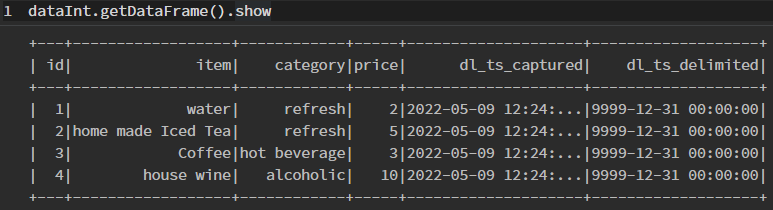

In many cases datasets have no constant live. New data points are created, values changed and data expires. We are interested in keeping track of all these changes.

<!--truncate-->

In the [getting-started -> part2 -> keeping historical data](../../docs/getting-started/part-2/historical-data.md) historization is already introduced briefly. Here we go in slightly more detail and track data originating from an SQL database. For the sake of simplicity, SDL, SQL server, as well as the metastoren and polynote get deployed in containers using Podman. 

Here we model a workflow from a (MS)SQL database to the Data Lake. Therefore, a the following steps will be performed:

* starting a MS SQL server
* creating a table with data
* injecting the table into the data lake
* modifying the data on the SQL server side
* re-copy / update the data into the data lake

The data will be inspected and monitored using a Polynote notebook.

## Test Case
As a test case a [Chess Game Dataset](https://www.kaggle.com/datasets/datasnaek/chess) is selected. This data is a set of 20058 rows, in total 7MB. This is still faily small, but should be kind of representative.

The dataset will be imported into the SQL server using the [db_init_chess.sql](db_init_chess.sql), which should be copied into the `config` directory. 

It should be noted that there are a duplicates in the dataset. The deduplication will be performed when the data is ported into the data lake (see configuration below). The procedure for table creation and modification is described below. 

## Prerequisites

* Podman installation
* SDLB with metastore and Polynote by cloning the getting-started example: 
  ```
  git clone https://github.com/smart-data-lake/getting-started.git SDL_sql
	cd SDL_sql
	unzip part2.additional-files.zip
  ```
* Utilizing JDBC to MS SQL server, SDL required this additional dependency. Therefore, add the following dependency to the `pom.xml`:
	```
	<dependency>
		<groupId>com.microsoft.sqlserver</groupId>
		<artifactId>mssql-jdbc</artifactId>
		<version>10.2.0.jre11</version>
	</dependency>
	```
* build sdl-spark: `podman build -t sdl-spark .`
* build the SDL objects: 
	```
	mkdir .mvnrepo
	podman run -v ${PWD}:/mnt/project -v ${PWD}/.mvnrepo:/mnt/.mvnrepo maven:3.6.0-jdk-11-slim -- mvn -f /mnt/project/pom.xml "-Dmaven.repo.local=/mnt/.mvnrepo" package
	```
:::warning
  update notebook
:::
* copy polynote notebook [sql_data_monitor.ipynb](sql_data_monitor.ipynb) for later inspection into the `polynote/notebook` directory

* script for creating table on the SQL server: [db_init_chess.sql](db_init_chess.sql) into the `config` directory

* script for modifying the table on the SQL server: [db_mod_chess.sql](db_mod_chess.sql) into the `config` directory

:::warning
  update the restart script
:::
* a restart script [restart_databases.sh](restart_databases.sh) is provided to clean and restart from scratch, including: stopping the containers, cleaning databases, freshly starting the containers and initializing the SQL database 

## Prepare Source Database
* start the pod with the metastore and polynote: 
  ```
  podman-compose up
  ```
* start the MS SQL server: 
  ```
  podman run -d --pod sdl_sql --hostname mssqlserver --add-host mssqlserver:127.0.0.1 --name mssql -v ${PWD}/data:/data  -v ${PWD}/config:/config -e "ACCEPT_EULA=Y" -e "SA_PASSWORD=%abcd1234%" mcr.microsoft.com/mssql/server:2017-latest
  ```
* intitalize the database: 
  ```
  podman exec -it mssql /opt/mssql-tools/bin/sqlcmd -S mssqlserver -U sa -P '%abcd1234%' -i /config/db_init_chess.sql
  ```
* list the table: 
  ```
  podman exec -it mssql /opt/mssql-tools/bin/sqlcmd -S mssqlserver -U sa -P '%abcd1234%' -Q "SELECT count(*) FROM foobar.dbo.chess"
  ```
  This should report 20058 row. 

:::Note
  This could be shortened, by just calling the `bash restart_databases.sh`
:::

## Define Workflow
The SDLB configuration file `config/application.conf` consists of global settings for the metastore, the connection, the data objects, and the actions. 

### Spark Settings
For the metastore, the location, driver and access is defined

```
global {
  spark-options {
    "spark.hadoop.javax.jdo.option.ConnectionURL" = "jdbc:derby://metastore:1527/db;create=true"
    "spark.hadoop.javax.jdo.option.ConnectionDriverName" = "org.apache.derby.jdbc.ClientDriver"
    "spark.hadoop.javax.jdo.option.ConnectionUserName" = "sa"
    "spark.hadoop.javax.jdo.option.ConnectionPassword" = "1234"
  }
}  
```

### Connection
The connection to the MS SQL server is specified using JDBC settings and clear text authentication specification. It needs to be mentioned that there a list of better authentication modes, which should be preferred. Here we use this for simplicity and reproducibility. 

```
connections {
  localSql {
    type = JdbcTableConnection
    url = "jdbc:sqlserver://mssqlserver:1433;encrypt=true;trustServerCertificate=true"
    driver = com.microsoft.sqlserver.jdbc.SQLServerDriver
    authMode {
      type = BasicAuthMode
      userVariable = "CLEAR#sa"
      passwordVariable = "CLEAR#%abcd1234%"
    }
  }
}
```
Note the specification of the SQL server name 

### DataObjects

The `ext-chess` data object defines the external source, using JDBC Table and the above defined connection. Further, delta lake tables as integration layer are defined as targets for our injection/historization action. 

```
dataObjects {
  ext-chess {
    type = JdbcTableDataObject
    connectionId = localSql
    table = {
      name = "dbo.chess"
      db = "foobar"
    }
  }
  int-chess {
    type = DeltaLakeTableDataObject
    path = "~{id}"
    table {
      db = "default"
      name = "int_chess"
      primaryKey = [id]
    }
  }
  #...
}
```

:::warning
  update file
:::

### Actions
The `histData*` actions define the copy and historization actions. 
By setting the action to the type **HistorizeAction** the historization of the data will be enabled. Therewith, the incoming data will be joined with the existing data. Each data point gets two additional values: **dl_ts_captured** and **dl_ts_delimited**. The first defines the time captured in the data lake. The second one defines the time of getting invalidated, e.g. not existing anymore or a change is recored. In case of change, the original row gets invalidated and a new row is added with the current caturing time.
By default, the resulting table will overwrite the existing data lake table.

Furthermore, a *transformer* is added to deduplicate the data, which has duplicated rows with slightly different game times. 

```
actions {
  histData {
    type = HistorizeAction
    inputId = ext-chess
    outputId = int-chess
    transformers = [{
      type = ScalaCodeDfTransformer
      code = """
        import org.apache.spark.sql.{DataFrame, SparkSession}
        (session:SparkSession, options:Map[String, String], df:DataFrame, dataObjectId:String) => {
          import session.implicits._
          df.dropDuplicates(Seq("id"))
        }
      """
   }]
   metadata {
      feed = hist
    }
  }
  #...
}
```

The full configuration looks like [application.conf](application.conf). 

## Run
The Pod with metastore, polynote and the "external" SQL server should already being running. Now the SDLB container is launched within the same POD:

```
podman run --hostname localhost -e SPARK_LOCAL_HOSTNAME=localhost --rm --pod sdl_sql -v ${PWD}/data:/mnt/data -v ${PWD}/target:/mnt/lib -v ${PWD}/config:/mnt/config sdl-spark:latest --config /mnt/config --feed-sel hist
```

This will initially inject the data into the data lake. In my case this *histData* action needed around 12s. 

Let's assume a change in the source database. Here the `victory_status` `outoftime` is renamed to `overtime` using:

```
podman exec -it mssql /opt/mssql-tools/bin/sqlcmd -S mssqlserver -U sa -P '%abcd1234%' -i /config/db_mod_chess.sql
```
Note: 1680 rows were changed.

Further the data lake gets updated using the same command as above:
```
podman run --hostname localhost -e SPARK_LOCAL_HOSTNAME=localhost --rm --pod sdl_sql -v ${PWD}/data:/mnt/data -v ${PWD}/target:/mnt/lib -v ${PWD}/config:/mnt/config sdl-spark:latest --config /mnt/config --feed-sel hist
```
Again, the run time of the action is noted. In my case, it needed around 40s, due to the fact that all the data need to be compared, the whole data lake table need to be rewritten. 

In the [Polynote (click here)](http://localhost:8192), the data in the data lake table can be inspected using the previously copied `sql_chessData.ipynb`. 
::: warning
  update notebook name
:::


::: warning
  update pictures, delete old ones
:::


## Optimizations

In the current, default HistorizationAction the all the new data is compared with all the exising data, row by row, column by column. Further, the complete joined table is re-written to the data lake. 

Smart Data Lake Builder provides a merge optimization for transactional database formats. By selecting `mergeModeEnable = true` the resulting table gets another column with `dl_hash`. This hash is used to compare rows much more efficiently. Further, already existing rows (identified by the hash), do not need to be re-written. 

Thus, the merge mode is enabled in the historization action:
```
  histDataMerge {
    type = HistorizeAction
    mergeModeEnable = true
    inputId = ext-chess
    outputId = int-chess-merge
    transformers = [{
    ...
```

and the process is started from scratch again:

* clean
* init SQL server with the dataset
* copy data to the data lake 
* change data on SQL server
* copy data to the data lake

```
bash restart_databases.sh    ### first cleaning the databases
podman run --hostname localhost -e SPARK_LOCAL_HOSTNAME=localhost --rm --pod sdl_sql -v ${PWD}/data:/mnt/data -v ${PWD}/target:/mnt/lib -v ${PWD}/config:/mnt/config sdl-spark:latest --config /mnt/config --feed-sel hist_merge
### note the timing

podman exec -it mssql /opt/mssql-tools/bin/sqlcmd -S mssqlserver -U sa -P '%abcd1234%' -i /config/db_mod_chess.sql

podman run --hostname localhost -e SPARK_LOCAL_HOSTNAME=localhost --rm --pod sdl_sql -v ${PWD}/data:/mnt/data -v ${PWD}/target:/mnt/lib -v ${PWD}/config:/mnt/config sdl-spark:latest --config /mnt/config --feed-sel hist_merge
### note the timing
```

After measuring the timings the following differences is noted:

|  | `mergeModeEnable = false` | `mergeModeEnable = true` |
| --- | -------------------- | ---------------------- |
| intital copy | 11.85 | 13 |
| copy of updated data | 40.3 |16.5 |

### Merge CDC data

