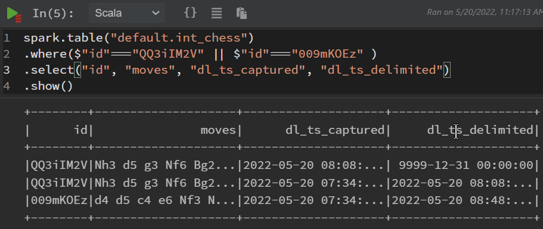

In many cases datasets have no constant live. New data points are created, values changed and data expires. We are interested in keeping track of all these changes.
This article first presents collecting data utilizing **JDBC** and **deduplication on the fly**. Then, a **Change Data Capture** (CDC) enabled (MS)SQL table will be transferred and historized in the data lake using the **Airbyte MS SQL connector** supporting CDC. Methods for reducing the computational and storage efforts are mentioned.

<!--truncate-->

In the [getting-started -> part2 -> keeping historical data](../../docs/getting-started/part-2/historical-data) historization is already introduced briefly. Here, we go in slightly more detail and track data originating from an MS SQL database. For the sake of simplicity, the tools and systems are deployed in Podman containers, including SDLB, MSSQL server, as well as the metastore and polynote. 

Here, a workflow is modeled, gathering data from a (MS)SQL database to the Data Lake. Therefore, the following steps will be performed:

* initializing a MS SQL server
* importing data into MS SQL table
* injecting data into the data lake
* modifying data on the SQL server side
* re-copy / update data into data lake

The data will be inspected and monitored using a Polynote notebook.


## Test Case
As a test case a [Chess Game Dataset](https://www.kaggle.com/datasets/datasnaek/chess) is selected. This data is a set of 20058 rows, in total 7MB. This is still faily small, but should be kind of representative.

The dataset will be imported into the SQL server using the [db_init_chess.sql](db_init_chess.sql) script, which should be copied into the `config` directory. 

It should be noted that there are a duplicates in the dataset. In the first case, the *deduplication* will be performed when the data is ported into the data lake (see configuration below). The procedure for table creation and modification is described below. 

## Prerequisites

* Podman installation
* SDLB with metastore and Polynote by cloning the getting-started example: 
  ```Bash
  git clone https://github.com/smart-data-lake/getting-started.git SDL_sql
	cd SDL_sql
	unzip part2.additional-files.zip
  ```
* Utilizing JDBC to MS SQL server, SDLB required this additional dependency. Therefore, add the following dependency to the `pom.xml`:
	```xml
	<dependency>
		<groupId>com.microsoft.sqlserver</groupId>
		<artifactId>mssql-jdbc</artifactId>
		<version>10.2.0.jre11</version>
	</dependency>
	```
* build sdl-spark: `podman build -t sdl-spark .`
* build the SDLB objects: 
	```Bash
	mkdir .mvnrepo
	podman run -v ${PWD}:/mnt/project -v ${PWD}/.mvnrepo:/mnt/.mvnrepo maven:3.6.0-jdk-11-slim -- mvn -f /mnt/project/pom.xml "-Dmaven.repo.local=/mnt/.mvnrepo" package
	```
* download the test case data from [Kaggle](https://www.kaggle.com/datasets/datasnaek/chess/download) and unzip into `SDL_sql/data` directory
* copy polynote notebook [sql_data_monitor.ipynb](sql_data_monitor.ipynb) for later inspection into the `polynote/notebooks` directory

:::warning
  The notebook will only be editable if the permissions are changed to be writable by other users `chmod +w polynote/notebook/sql_data_monitor.ipynb`
:::

* script for creating table on the SQL server: [db_init_chess.sql](db_init_chess.sql) into the `config` directory
* script for modifying the table on the SQL server: [db_mod_chess.sql](db_mod_chess.sql) into the `config` directory
* a restart script [restart_databases.sh](restart_databases.sh) is provided to clean and restart from scratch, including: stopping the containers, cleaning databases, freshly starting the containers and initializing the SQL database 

## Prepare Source Database
* start the pod with the metastore and polynote: 
  ```Bash
  podman-compose up
  ```
* start the MS SQL server: 
  ```Bash
  podman run -d --pod sdl_sql --hostname mssqlserver --add-host mssqlserver:127.0.0.1 --name mssql -v ${PWD}/data:/data  -v ${PWD}/config:/config -e "ACCEPT_EULA=Y" -e "SA_PASSWORD=%abcd1234%" mcr.microsoft.com/mssql/server:2017-latest
  ```
* initialize the database: 
  ```Bash
  podman exec -it mssql /opt/mssql-tools/bin/sqlcmd -S mssqlserver -U sa -P '%abcd1234%' -i /config/db_init_chess.sql
  ```
* list the table: 
  ```Bash
  podman exec -it mssql /opt/mssql-tools/bin/sqlcmd -S mssqlserver -U sa -P '%abcd1234%' -Q "SELECT count(*) FROM foobar.dbo.chess"
  podman exec -it mssql /opt/mssql-tools/bin/sqlcmd -S mssqlserver -U sa -P '%abcd1234%' -Q "SELECT * FROM foobar.dbo.chess WHERE id = '079kHDqh'"
  ```
  This should report 20058 row and we see an example of duplicates.

:::note
  This could be shortened, by just calling the [`bash restart_databases.sh`](restart_databases.sh), which contains the above commands, after stopping the containers and cleaning directories. 
:::

## Define Workflow
The SDLB configuration file [`config/chess.conf`](chess.conf) consists of global settings for the metastore, the connection, the data objects, and the actions. 

### Spark Settings
For the metastore, the location, driver and access is defined. Further, the amount of tasks and partitions are limited, due to our reasonable small problem size.

```hocon
global {
  spark-options {
    "spark.hadoop.javax.jdo.option.ConnectionURL" = "jdbc:derby://metastore:1527/db;create=true"
    "spark.hadoop.javax.jdo.option.ConnectionDriverName" = "org.apache.derby.jdbc.ClientDriver"
    "spark.hadoop.javax.jdo.option.ConnectionUserName" = "sa"
    "spark.hadoop.javax.jdo.option.ConnectionPassword" = "1234"
    "spark.databricks.delta.snapshotPartitions" = 2
    "spark.sql.shuffle.partitions" = 2
  }
}  
```

### Connection
The connection to the local MS SQL server is specified using JDBC settings and clear text authentication specification. In practice, a more secure authentication mode should be selected, e.g. Keycloak or tokens. 

```hocon
connections {
  localSql {
    type = JdbcTableConnection
    url = "jdbc:sqlserver://mssqlserver:1433;encrypt=true;trustServerCertificate=true"
    driver = com.microsoft.sqlserver.jdbc.SQLServerDriver
    authMode {
      type = BasicAuthMode
      userVariable = "CLEAR#sa"
      passwordVariable = "CLEAR#%abcd1234%"
    }
  }
}
```


### DataObjects

In a first place, two dataObjects are defined. The `ext-chess` defining the external source (the table on the MS SQL server), using JDBC connection. The `int-chess` defines a delta lake table object as integration layer as targets for our injection/historization action. 

```hocon
dataObjects {
  ext-chess {
    type = JdbcTableDataObject
    connectionId = localSql
    table = {
      name = "dbo.chess"
      db = "foobar"
    }
  }
  int-chess {
    type = DeltaLakeTableDataObject
    path = "~{id}"
    table {
      db = "default"
      name = "int_chess"
      primaryKey = [id]
    }
  }
  #...
}
```

### Actions
The `histData` action specifies the copy and historization of data, by setting the type **HistorizeAction**. Therewith, the incoming data will be joined with the existing data. Each data point gets two additional values: **dl_ts_captured** (time the data is captured in the data lake) and **dl_ts_delimited** (time of invalidation). In case of a data record change, the original row gets invalidated (with the current time) and a new row is added with the current time as capturing value. As long as the data point is active and the latest value, **dl_ts_delimited** is set to max date `9999-12-31 23:59:59.999999`. After merging the incoming data with the existing table, by default, the resulting table will overwrite the existing data lake table.

The default HistorizationAction compares all new data with all the exising data, row by row **AND** column by column. Further, the complete joined table is re-written to the data lake. 
Smart Data Lake Builder provides a merge optimization for transactional database formats. By selecting `mergeModeEnable = true` the resulting table gets another column with `dl_hash`. This hash is used to compare rows much more efficiently. Not every column need to be compared, only the hash. Further, already existing rows (identified by the hash), do not need to be re-written. 

Furthermore, a *transformer* needs to be added to deduplicate the input data, which has duplicated rows with slightly different game times. This is needed as HistorizationAction expects the input to be unique over the primary key of the output DataObject.

```hocon
actions {
  histData {
    type = HistorizeAction
    mergeModeEnable = true
    inputId = ext-chess
    outputId = int-chess
    transformers = [{
      type = ScalaCodeDfTransformer
      code = """
        import org.apache.spark.sql.{DataFrame, SparkSession}
        (session:SparkSession, options:Map[String, String], df:DataFrame, dataObjectId:String) => {
          import session.implicits._
          df.dropDuplicates(Seq("id"))
        }
      """
   }]
   metadata {
      feed = download
    }
  }
  #...
}
```

The full configuration looks like [chess.conf](chess.conf). Note that there are already further dataObjects and actions defined, described and used later. 

## Run

The Pod with metastore, polynote and the "external" SQL server should already being running. Now the SDLB container is launched within the same POD and the action histData injects the data into the data lake:

```Bash
podman run --hostname localhost -e SPARK_LOCAL_HOSTNAME=localhost --rm --pod sdl_sql -v ${PWD}/data:/mnt/data -v ${PWD}/target:/mnt/lib -v ${PWD}/config:/mnt/config sdl-spark --config /mnt/config --feed-sel ids:histData
```

The data can be inspected using the Polynote notebook (`chessData.ipynb` downloaded above), which can be launched using [Polynote (click here)](http://localhost:8192/notebook/sql_data_monitor.ipynb). 

Now, let's assume a change in the source database. Here the `victory_status` `outoftime` is renamed to `overtime`. Furthermore one entry is deleted. Run script using:

```Bash
podman exec -it mssql /opt/mssql-tools/bin/sqlcmd -S mssqlserver -U sa -P '%abcd1234%' -i /config/db_mod_chess.sql
```
Note: 1680 rows were changed.

Furthermore, the data lake gets updated using the same command as above:
```Bash
podman run --hostname localhost -e SPARK_LOCAL_HOSTNAME=localhost --rm --pod sdl_sql -v ${PWD}/data:/mnt/data -v ${PWD}/target:/mnt/lib -v ${PWD}/config:/mnt/config sdl-spark --config /mnt/config --feed-sel ids:histData
```

In the [Polynote (click here)](http://localhost:8192/notebook/sql_data_monitor.ipynb) sql_data_monitor.ipynb, the data lake table can be inspected again. The table and its additional columns are presented, as well as the original and updated rows for a modified row (*id = QQ3iIM2V*) and the deleted row (*id = 009mKOEz*).



## Change Data Capture

So far the whole table is collected and compared with the existing data lake table. 
Various databases support Change Data Capture (CDC). CDC already keeps track of changes similar to the comparision done by the historization feature of SDL. 
this can be used to optimize performance of the historiation feature, gathering only database updates, reducing the amount of transferred and compared significantly. Therewith, only data changed (created, modified, or deleted) since the last synchronisation will be read from the database. It needs the status of the last synchronistation to be attached to the successful stream. This **state** is handled in SDLB. 

In the following, an example is presented utilizing the MS SQL server CDC feature. Since the implemented JDBC connector cannot handle CDC data, an Airbyte connector is utilized, see [Airbyte CDC](https://docs.airbyte.com/understanding-airbyte/cdc/) for details.

### Enable CDC on the SQL Server
First the SQL server need to be configured to have a table [CDC enabled](https://docs.microsoft.com/en-us/sql/relational-databases/track-changes/enable-and-disable-change-data-capture-sql-server?view=sql-server-ver15). Additionally to the used table *chess*, another table is created with the CDC feature enabled. This table *chess_cdc* is created by copying and deduplicating the original table. The table creation is already performed in the above introduced and used [MS SQL initalization](db_init_chess.sql) script. In practice, further SQL settings should be considered, including proper user and permissions specification, and an adaptation of the retention period (3 days default). 

Furthermore, the SQL agent need to be enabled. Therefore, the database need to be restarted (here container is restarted). This is handled in the above mentioned [restart_databases.sh](restart_databases.sh) script. If not already used above, run:

```Bash
bash restart_databases.sh
```


Let's double check the CDC enabled table:

```Bash
podman exec -it mssql /opt/mssql-tools/bin/sqlcmd -S mssqlserver -U sa -P '%abcd1234%' -Q "SELECT * FROM foobar.cdc.dbo_chess_cdc_CT where id = '079kHDqh'"
```

Here the first 5 columns are added for the CDC. Here, only *id* and *victory_status* are selected from the original table. The other columns originating from the related CDC tables. 
It should be noted that CDC additional data vary from implementation to implementation. 

### Airbyte MSSQL connector
Since the implemented JDBC (used above) does not support CDC data, the connector is changed to [Airbyte MSSQL](https://docs.airbyte.com/integrations/sources/mssql). In contrast to the article [Using Airbyte connector to inspect github data](../blog/2022-03-18-SDL-airbyte/2022-03-18-SDL-airbyte.md), where Airbyte github connector ran as python script, here the connector runs as a container within the SDLB container. 
I targeted a setup using: WSL2, SDLB with podman, and the Airbyte container with podman in the SDLB container. Unfortunately, there are issues with fuse overlay. Therefore, I switched to [buildah](https://buildah.io/) in the SDLB container. Unfortunately, the entrypoint is not recognized as expected. As a workaround the following script corrects this. 
I guess in another environment, e.g. in a cloud environment or just using docker in docker, this would work out of the box. 

Here are my steps to get it running:
* add buildah and the Airbyte container to the SDLB [Dockerfile](Dockerfile.txt) (just before the entrypoint):
  ```Bash
  RUN apt-get update
  RUN apt-get -y install buildah
  RUN echo 'unqualified-search-registries=["docker.io"]' >> /etc/containers/registries.conf
  RUN buildah --storage-driver=vfs from --name airbyte-mssql docker.io/airbyte/source-mssql
  ```
* rebuild the SDLB container: `podman build -t sdl-spark .`
* workaround script to parse all arguments correctly in the Airbyte container while using buildah without the proper entrypoint. Copy [start_buildah.sh](start_buildah.sh) script into `config` directory

### SDLB configuration
Now, the related dataObjects and action are added to the SDLB configuration [config/chess.conf](chess.conf).

#### DataObject
As a source object the AirbyteDataObject is used. Again the MSSQL server with the user credentials are specified. Further, in the streamName the table is selected. The cmd specifies how to run Airbyte. Here the mentioned workaround script is called in the container. As target, again a Delta Lake table is chosen, here called `int_chess_cdc`. Practically, we would prevent of duplicating tables, here we create a new one to provide the possibility to compare both results. 
```hocon
dataObjects {
    ext-chess-cdc {
    type = AirbyteDataObject
    config = {
      host = "mssqlserver"
      port = 1433
      database = "foobar"
      username = "sa"
      password = "%abcd1234%"
      replication_method = "CDC"
    },
    streamName = "chess_cdc",
    cmd = {
      type = DockerRunScript
      name = "airbyte_source-mssql"
      image = "airbyte-mssql"
      linuxDockerCmd = "bash /mnt/config/start_buildah.sh"
    }
  }
  int-chess-cdc {
    type = DeltaLakeTableDataObject
    path = "~{id}"
    table {
      db = "default"
      name = "int_chess_cdc"
      primaryKey = [id]
    }
  }
}
```
#### Action
Again the SDLB action *HistorizeAction* with *mergeModeEnabled* is selected. Further, the incremental execution mode is enabled. With CDC we get only changed data, which will be merged with the SDL existing table. Further, the column and value need to be specified to identify deleted data points. Depending on the CDC implementation this could be the deletion date (like we have here) or an operation flag mentioning the deletion operation as code, or even differently. SDLB expects a fixed value for deletion, why we here specify an `AdditionalColumnsTransformer` transformer to first create an intermediate column mapping any date to *true*. 
```hocon
actions {
  histDataAirbyte {
    type = HistorizeAction
    mergeModeEnable = true
    executionMode = { type = DataObjectStateIncrementalMode }
    inputId = ext-chess-cdc
    outputId = int-chess-cdc
    mergeModeCDCColumn = "cdc_deleted"
    mergeModeCDCDeletedValue = true
    transformers = [{
      type = AdditionalColumnsTransformer
      additionalDerivedColumns = {cdc_deleted = "_ab_cdc_deleted_at is not null"}
    }]
    metadata {
      feed = download
    }
  }
}
```

Finally, SDLB is launched using the same settings as above, now with the feed `ids:histDataAirbyte` and the specifying the *state* directory and name:
```Bash
podman run --hostname localhost -e SPARK_LOCAL_HOSTNAME=localhost --rm --pod sdl_sql -v ${PWD}/data:/mnt/data -v ${PWD}/target:/mnt/lib -v ${PWD}/config:/mnt/config sdl-spark --config /mnt/config --feed-sel ids:histDataAirbyte --state-path /mnt/data/state -n SDL_sql
```
Again the SQL database modification is processed using [config/db_mod_chess_cdc.sql](db_mod_chess_cdc.sql): 
```Bash
podman exec -it mssql /opt/mssql-tools/bin/sqlcmd -S mssqlserver -U sa -P '%abcd1234%' -i /config/db_mod_chess_cdc.sql
```
And the SDL update with the same command as just used:
```Bash
podman run --hostname localhost -e SPARK_LOCAL_HOSTNAME=localhost --rm --pod sdl_sql -v ${PWD}/data:/mnt/data -v ${PWD}/target:/mnt/lib -v ${PWD}/config:/mnt/config sdl-spark --config /mnt/config --feed-sel ids:histDataAirbyte --state-path /mnt/data/state -n SDL_sql
```

Again the delta lake tables can be inspected using [Polynote (click here)](http://localhost:8192/notebook/sql_data_monitor.ipynb).

## Summary

Smart Data Lake Builder (SDLB) provides a powerful too to capture data from SQL databases and provides features to track changes. As well as optimized procedures to process Change Data Capture (CDC) data. There are various connectors to interact with SQL databases (e.g. JDBC and Airbyte). Powerful transformers help to handle the data stream within the action, e.g. for deduplication. Furthermore, the join, and merge of new data with existing tables, as well as the writing of the data is optimized, reducing the computational an IO efforts. 
