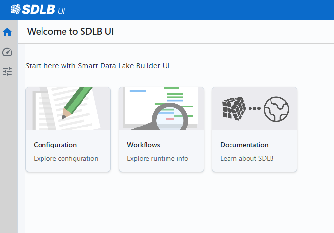
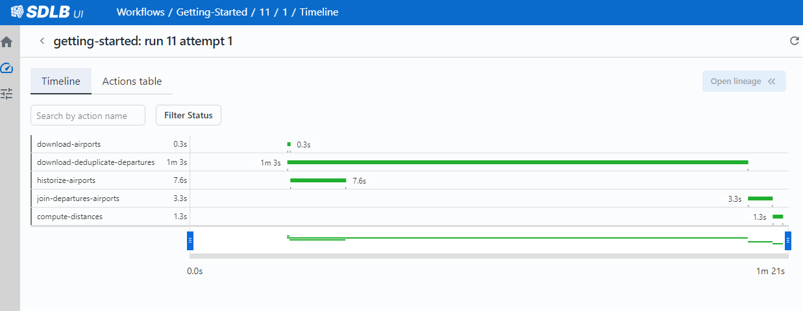
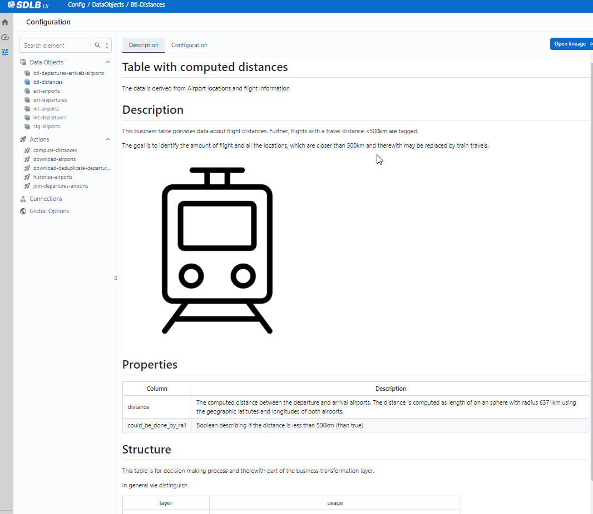
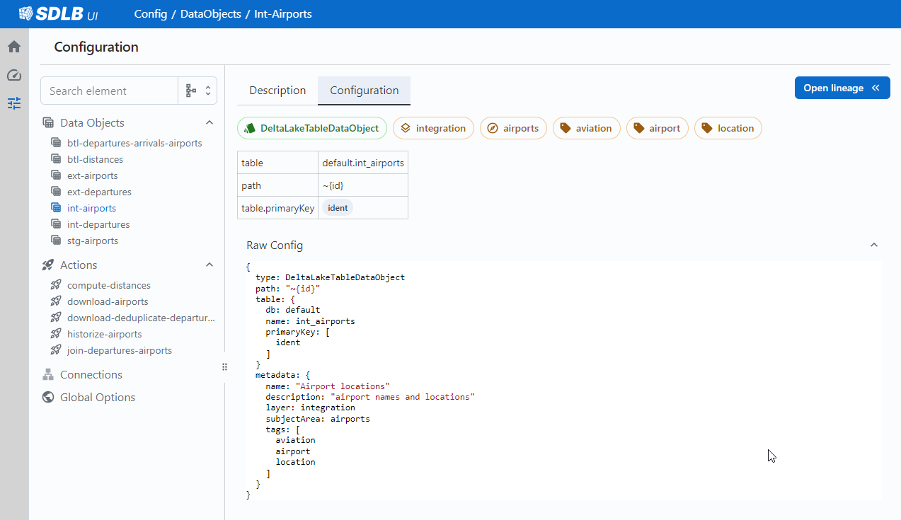
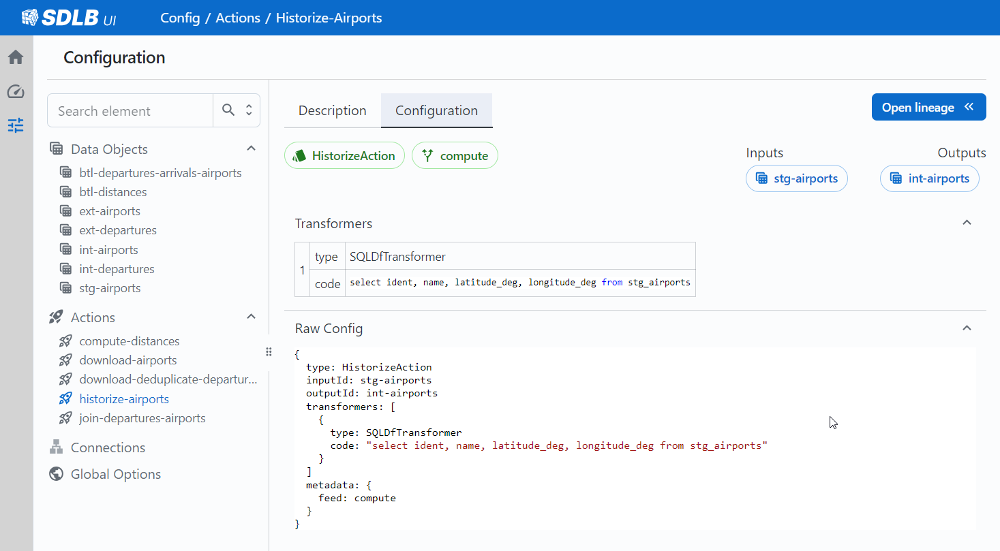
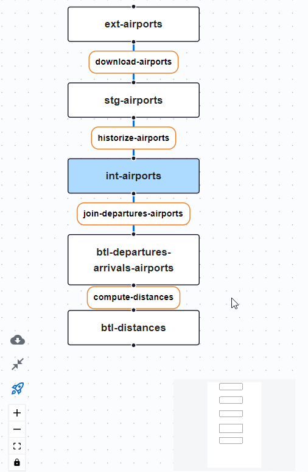

We are thrilled to announce the launch of our new [UI tool](https://ui-demo.smartdatalake.ch/) designed to revolutionize the way visualize, track, and manage data flow! This extension of SDLB  acts as a user-friendly data catalog that showcases dependencies through a DAG, along with metadata for data objects and actions. Our UI tool is a step forward in data pipeline management, providing enhanced visibility and control. Whether you are a data engineer, analyst, or scientist, this tool will enhance your workflow management experience, allowing you to optimize processes and achieve exceptional results.

<!--truncate-->

## 🌟 Explore Our UI Tool in Action

Now Check out our UI-demo, where the data pipeline in the [getting-started](../../docs/getting-started/setup) section with the part 3 [config file](../config-examples/application-part3-download-incremental-mode.conf) is used as an example for our UI tool. Witness firsthand how our tool simplifies data pipeline management and enhances your workflow efficiency: [UI-Demo Link](https://ui-demo.smartdatalake.ch/)

<!--truncate-->

Thanks to its user-friendly interface and powerful features, managing complex workflows has never been easier.

## 📊 Comprehensive Workflow Dashboard
Get a bird's eye view of your entire workflow! Our intuitive dashboard visualizes intricate details for each run, including execution time, duration, and the feed used. Dive deep into the timeline of  involved actions, with the ability to access detailed data by simply clicking on each action.

## 🔍 Config Viewer with Rich Content
Explore an expansive Config Viewer that contains all the information from your config file. And extra information you provide as documentation. You can find:

* ###  Markdown Descriptions:
  Our tool supports markdown files as descriptions, enabling you to add detailed information about actions or objects. These descriptions can include images, hyperlinks, and other formatting options, serve as excellent documentation, aiding your understanding of the workflow's structure and function. Moreover, you can utilize descriptions to add labels by incorporating metadata in the config file, enhancing organization and clarity.
  
  
  

* ### Clear Visualization of Transformations:
  For actions involving transformations, our tool provides clear visualizations within the configuration. Easily comprehend input and output data for each action, with seamless links to corresponding data objects. This feature simplifies the understanding of complex data transformations, ensuring transparency and efficiency in your workflow.

* ### Data Lineage Graph:
  Track and understand the flow of data objects across various processing stages with our built-in lineage feature. Visualize the relationships between data objects and actions involved in your data pipeline, empowering you to monitor the data's journey and make informed decisions.
  

Don't miss out on this game-changing tool! Embrace the future of data pipeline visualization and empower your team with the insights they need to excel. Get started today and explore the tool now on our [GitHub repository](https://github.com/smart-data-lake/sdl-visualization) and revolutionize the way you manage data pipelines.

