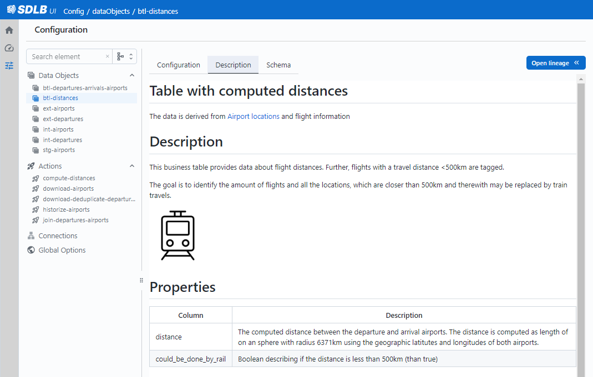

We are thrilled to announce a major overhaul of the __SDLB UI__ designed to revolutionize the way we visualize, track, and manage data pipelines! 
This addition to SDLB acts as a user-friendly technical data catalog that showcases dependencies through a lineage graph, along with metadata about data pipeline execution (workflows). 

SDLBs UI tool is a step forward in data pipeline management, providing enhanced visibility and control. 
Whether you are a data engineer, analyst, or scientist, this tool will enhance your abilities to manage data pipelines, 
allowing you to be more productive and achieve exceptional results.

## 🌟 See it in action

Check out the new [UI-Demo](https://ui-demo.smartdatalake.ch/), where the final data pipeline of our [Getting Started Guide](/docs/getting-started/setup) is used as an example for our UI tool.
Witness firsthand how our tool simplifies data pipeline management and enhances your workflow efficiency.

Thanks to its user-friendly interface and powerful features, managing complex workflows has never been easier.

## 📊 Comprehensive Workflow Dashboard

Get a bird's eye view of your data pipelines! Our new intuitive dashboard visualizes intricate details for each run, 
including execution time, duration, and the feed configuration used.
Deep dive into the timeline of involved actions, with the ability to access detailed execution metrics by simply clicking on each action.

## 🔍 Configuration Viewer with Rich Content

Explore your configuration using the Configuration Viewer that contains all the information from your config file, 
and extra information you provide as documentation. You can find:

### Configuration Details 

View all the details of your SDLB configuration in an appealing UI.
For DataObjects the page is enriched with a list of the last SDLB Runs that modified the corresponding data, and some table statistics:

Tags help to organize configuration objects and find related items.

###  Markdown Descriptions

SDLB supports creating descriptions as markdown files, enabling you to provide comprehensive documentation about DataObjects and Actions. 
Markdown description files can include images, hyperlinks, and other formatting options: 

Good documentation is very important for long-term maintenance of data pipelines.
The benefit of this documentation is that it's versioned together with your code and can be part of your code reviews.

### Schema and Column Statistics

The UI can now also show the schema of DataObjects, including column statistics:

This helps a lot to get a better first impression of the content of a DataObject.
Schema and Statistics must be exported regularly using a Command Line Tool.
Best practice is to make this part of your release pipeline.

### Transformation Documentation

For Actions the UI provides clear visualizations of the transformers applied.
For Custom transformers implemented as Scala classes the view is enriched with source code documentation:  

This feature simplifies the understanding of complex data transformations, and again encourages to version documentation and code together, following the "documentation as code" approach. 

### Lineage Graph

Track and understand the flow of data across various processing stages with lineage graph visualization.
Visualize the dependencies between data objects and actions involved in your data pipeline, empowering you to monitor the data flow and answer questions about the impact of changes.

The visualization supports switching between the graph of Actions (control flow), the graph of DataObjects (data flow), and a complete flow of Actions and DataObjects as shown in the screenshot above.
You can expand/collapse all up- and downstream nodes at once, or just individual edges one-by-one. And you can switch between vertical and horizontal layout.

## Summary and Outlook

The SDLB UI is game-changing tool to maintain and operate data pipelines more efficiently!
Get started today using the installation guide on the [sdl-visualization](https://github.com/smart-data-lake/sdl-visualization) GitHub repository.
Or try out our [Getting Started Guide](/docs/getting-started/setup), where you learn more about descriptive metadata and the UI in [part 3](http://localhost:3000/docs/getting-started/part-3/metadata).

For sure we will further invest to advance the UI. Features on the roadmap are real-time workflow run updates, improved metrics statistics and grouping in the lineage graph.
Should you have suggestions for improvements or bug reports, feel free to create an [issue](https://github.com/smart-data-lake/sdl-visualization/issues).

Soon, we also plan to release the UI "as-a-service". This will further simplify its usage for projects and production use.
Stay tuned!

