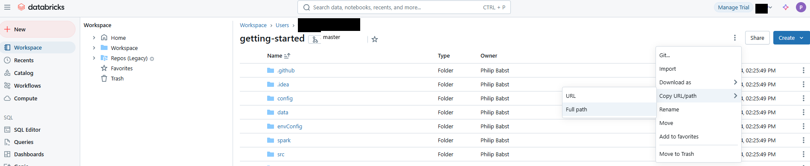
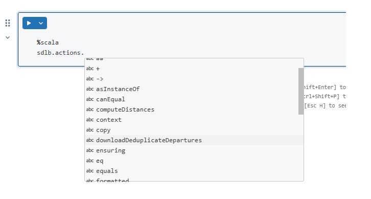

The [Databricks](https://databricks.com) platform provides an easy accessible and easy configurable way to implement a modern analytics platform. 
Smart Data Lake Builder complements Databricks as an open source, portable automation tool to load and transform the data.

In this article, we describe the seamless integration of Smart Data Lake Builder (SDLB) in Databricks Notebooks, which allows you to:
- Run and Modify SLDB Pipelines directly in Databricks  
- Display contents of DataObjects in your Notebooks
- Use code completion to browse through Actions and DataObjects
- Execute individual Actions from a Notebook Cell

We will use our [getting-started guide](../../docs/getting-started/setup) as an example data pipeline. This will download data about airports and plane departures and do some calculations.
Feel free to check out our guide for a step-by-step walkthrough on what it does.

Before jumping in, it should be mentioned that there are also many other methods to deploy SDLB in the cloud, e.g. using containers on Azure, Azure Kubernetes Service, Azure Synapse Clusters, Google Dataproc...
The method described here provides the advantage of having many aspects taken care of by Databricks like Cluster management, Job scheduling and integrated data science notebooks.
Also, the SDLB pipeline that is described here is just a simple example, focusing on the integration into the Databricks environment. 
For a detailed list of what SDLB can do, see [Features](../../docs/features). 

Let's get started:

1. [**Databricks**](https://databricks.com) accounts can be created in various ways. This guide has been tested using a [Free Trial](https://databricks.com/try-databricks) with the AWS backend. For this, we created an account using an email-address with Root User sign in.
        Then, we used the **Workspace stack** by using Quickstart as described in the documentation. Then, we simply launched the Workspace and can kept all default options.

        Conceptually, there are no differences to the other providers. If you already have an Azure, AWS or Google Cloud account/subscription this can be used, otherwise you can register a trial subscription there. 

2. **Cluster Setup** In the Databricks UI, create a compute cluster. Pay attention to the following settings:
       - `Databricks Runtime Version`. This needs to match the Spark and Scala versions of SDLB. When writing this post, we used `15.4 LTS (includes Apache Spark 3.5.0, Scala 2.12)`, together with SDLB Version `2.7.1`. 
Note that only the major and minor versions must match, patch versions can differ. For example, SDLB Version `2.7.1` uses Spark `3.5.2` with Scala `2.12.15`. Alternatively, SDLB can be build with a different Spark version, see also [Architecture](../../docs/architecture) for supported versions.  
       - We want to use Java Version 17, which is not the default in Databricks as of December 2024. To use Java 17, do this: Under `Advanced options` in the `Spark` tab, add the following line to the `Environment variables` field: 
    ```
    JNAME=zulu17-ca-amd64
    ```
3. **Catalog Setup**
      - Setup the Catalog were we will store our data. For this, go to the `Catalog` menu and create a new catalog called `my_catalog`.
 You can pick catalog, schema and volume names to your liking but just make sure that they are in sync with the contents of [the environment config template file](https://github.com/smart-data-lake/getting-started/blob/feature/databricks-blog/envConfig/databricks.conf.template#L7).  
      - In the `default` schema, create a new `managed volume` called `getting-started`.
      - Why do we need a volume? Because we need a place to store the JAR of SDLB, as well as state files. 
This place needs to be accessible from the Spark Driver, the Spark Executors,  as well as from any Databricks Notebook. 
Volumes are great for sharing data like that.
4. **Run Part 1 of the Notebook**         
       - In your Workspace, click on Create -> Git folder. In the field called `Git repository URL`, enter `https://github.com/smart-data-lake/getting-started.git` and select `Github` as `Git Provider`. Check out the code of our `getting started` (TODO for now branch feature/databricks-blog, change to master when merged) 
   - Open the notebook called DatabricksDemo. You will notice that the first cell lets you set some parameters: 
     - REPODIR: The location in Databricks were you checked out your repository. You can simply copy/paste the path of the `getting-started` folder that you checked out using the button in the Databricks UI as follows: 
     - TMPDIR: A location for temporary files, needed by maven when running the Notebook the first time. You can keep the default.
     - VOLDIR: The Databricks Path to the `getting-started` volume that you just created.
   - Run the first cell to have the buttons appear. Then, fill the 3 parameters REPODIR, TMPDIR, VOLDIR with your values and click on `Run All`.
   - The first cells in the notebook should run correctly, but the Cell below `Convert the HOCON Config Files to Scala Classes` will fail with the message `error: object smartdatalake is not a member of package io`. 
This is because the Notebook does not yet have access to the SDLB Jar...
5. **Install getting-started-with-dependencies.jar**
- Back in the `Compute` Tab, select your cluster and edit it. Under `Libraries`, select `Install new` 
and select `getting-started-with-dependencies.jar` in the `getting-started` volume.
- Restart the Cluster so that the new Library gets imported.
- Now, the cell should run. The final 2 cells are still not working, because there is no data to display yet. Let's change that.
6. **Run getting-started as a Databricks Job**:
    Let's get some data. In the `Workflows` tab, click on `Create Job` and unser `Tasks` click on `+ Add task`.
	- **Task Name** : Run_all_actions
    - **Type**: `JAR`
	- **Main Class**: `io.smartdatalake.app.DefaultSmartDataLakeBuilder`
	- **add** *Dependent Libraries*: select `getting-started-with-dependencies.jar` in the `getting-started` volume.
	- **Cluster** select your cluster
	- **Parameters**: Replace the placeholders REPODIR and VOLDIR with the ones you have set.  
```
   [ "-c","file:///REPODIR/config,file:///REPODIR/envConfig/dev.conf","--feed-sel",".*","--state-path","VOLDIR/state","-n","getting-started","--parallelism","2" ] 
```

- **Launch** the job. This can take a minute or two.
- When finished, all cells in the noebook will be working.

7. **Results**
- You can observe the available DataObjects and Actions using our [UI Demo](https://ui-demo.smartdatalake.ch/#/config). Feel free to checkout out [our blog post](sdl-uidemo) for more information on the UI.
- Feel free to browse through the DataObjects and Actions as illustrated in the Notebook. From now on, it's enough to execute the current cell to get immediate feedback. All the necessary setup steps only need to be done when the cluster is started.
- If you want to use code completion, start typing something and hit CTRL + SPACE:
 
- Finally, you can directly edit the config files under REPODIR/config und re-run your job with your changes, directly within the databricks environment. 
Note that the files that end with .*solution are ignored by SDLB, they are just there for people following the `getting-started` guide.
