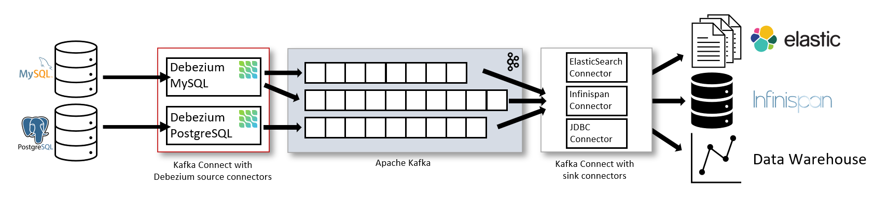
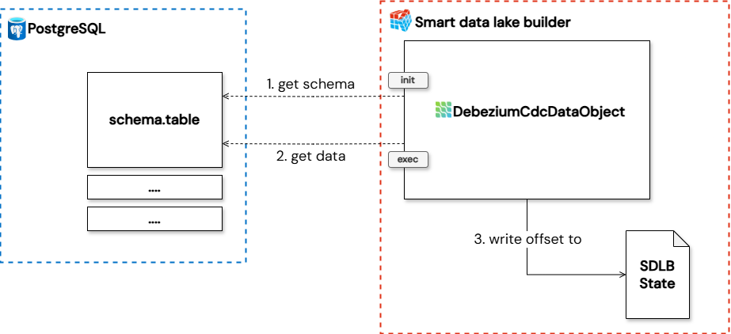

Change Data Capture (CDC) is a vital process for tracking and propagating changes in databases in real-time. [Debezium](https://debezium.io/), an open-source platform from Red Hat, stands as a powerful tool in this domain, capturing row-level changes and streaming them as events. Traditionally, Debezium leverages Kafka Connect for continuous, real-time monitoring and event delivery. While this setup is highly efficient for high-volume, real-time workloads, its continuous operation can lead to significant resource consumption and increased costs, particularly when real-time processing isn't a strict requirement for all use cases.

## Introducing SDLB for optimized CDC
For scenarios where constant real-time streaming isn't essential, SDLB offers an efficient and cost-effective alternative. Instead of relying on a continuously running Kafka Connect service, or when leveraging Debezium Server, SDLB can directly consume Debezium events via the Debezium Engine. This allows for batch or micro-batch processing, scaling resources up or down as needed, and significantly reducing operational costs by utilizing resources only when actively processing data.

This hybrid approach, combining Debezium's powerful CDC capabilities with SDLB's flexible automations, provides several advantages:

- **Optimized Resource Utilization:** Resources are consumed only when data processing is active, leading to cost savings.

- **Cost Efficiency:** Reduce infrastructure costs associated with persistent Kafka Connect clusters or continuous Debezium Server deployments.

- **Improved Pipeline Visibility:** SDLB's declarative pipeline capabilities can offer better insights and control over data flows.

## Implementation details
The diagram below provides a high-level overview of how the Smart Data Lake Builder (SDLB) interacts with a database via DebeziumCdcDataObject to achieve Change Data Capture. A DebeziumCdcDataObject needs to be defined per database table.

1. **Schema inference:** During this phase, the Debezium connector, is called with specific settings for optimized schema inference including custom snapshot query. The purpose of this query is to retrieve only one record from the source database and not the whole table as snapshot. This single record is crucial for schema inference. SDLB uses this minimal data point to understand the structure of the data being captured by Debezium, preparing its internal data models for subsequent processing
(for more details on sdlb phases, refer to the [documentation here](../../docs/reference/executionPhases)). The debezium offset in this phase is not stored in the state and is temporary.

2. **Execution phase:** Following successful schema inference in the init phase, the exec phase handles the real data processing. In this phase, the Debezium connector is called with the full set of configured properties. It then continuously processes the change events in batches as orchestrated by SDLB, from the source database. SDLB consumes these events, applies any necessary transformations, and routes them to the designated downstream data object.

DebeziumCdcDataObject and the underlying connector can be parameterized over the input of the various debezium connector properties that can be found in the Debezium documentation. These settings can be set in the `debeziumProperties` parameter of the DebeziumCdcDataObject. All settings are supported with one exception. `table.include.list` will always be overwritten by the data object.

## What is the schema for the change data feed
When you read the change event data, the schema for the latest table version is used. Debezium transforms some data types before sending them to SDLB. Debezium provides this information in the corresponding connector documentation in a section called `data type mappings` (f.e. see [MySQL data types mapping](https://debezium.io/documentation/reference/stable/connectors/mysql.html#mysql-data-types)).

In addition to the data columns from the schema of the Debezium change event, SDLB adds metadata columns that identify the type of change event:

| **Column name**   | **Type**  | **Values**                                                   |
|-------------------|-----------|--------------------------------------------------------------|
| __commit_event    | String    | create, update_preimage, update_postimage, delete, read (*)  |
| __event_timestamp | Timestamp | The timestamp associated when the commit was created.        |

:::info
(*) **preimage** is the value before the update, **postimage** is the value after the update. **Read** are the events that are read during the snapshot phase.
:::

## Current limititations
While powerful, the integration of SDLB with Debezium does present some specific limitations:

- **Missing Connectors:** Currently, the SDLB-Debezium integration does not natively support all Debezium connectors. Databases such as Vitess, MongoDB, Spanner, and Cassandra are currently not supported.

- **Dependency Conflicts:** For certain database connectors, particularly MySQL and MariaDB, integrating with SDLB + Spark led to dependency conflicts. Therefore the use of the "shaded" Connector JARs for these connectors is needed. They bundle the debezium dependencies to avoid clashes with SDLB's existing libraries.

- **Cold Start Problem with Schema Inference:** A common issue arises during a "cold start" when SDLB attempts to read the schema from a table that does not have any CRUD change events and the Debezium Engine doesn't receive a record. This prevents SDLB from inferring the schema in the [dag init phase](../../docs/reference/executionPhases). necessary to process subsequent data. The solution involves defining a schemaMin property on the Debezium data object within SDLB's configuration, ensuring that SDLB has a minimum schema definition even without an initial data record for inference.