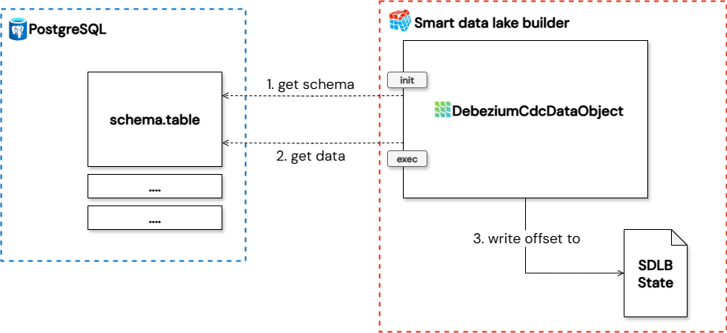
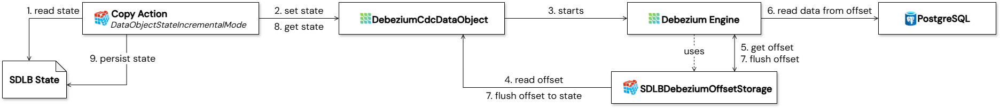
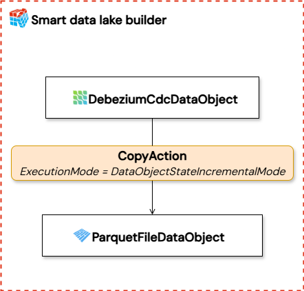

Change Data Capture (CDC) is a vital process for tracking and propagating changes in databases in real-time. [Debezium](https://debezium.io/), an open-source platform from Red Hat, stands as a powerful tool in this domain, capturing row-level changes and streaming them as events. 

This article focuses on the integration of Debezium within SDLB and demonstrates how it can be leveraged for change data capture and processing.
<!-- truncate -->

Traditionally, Debezium leverages Kafka Connect for continuous, real-time monitoring and event delivery. While this setup is highly efficient for high-volume, real-time workloads, its continuous operation can lead to significant resource consumption and increased costs, particularly when real-time processing isn't a strict requirement for all use cases.


In a typical architecture, Debezium source connectors such as those for MySQL and PostgreSQL are used to tap directly into the transaction logs of relational databases. These connectors stream every insert, update, and delete operation into Apache Kafka, which serves as the central event bus. From there, Kafka Connect sink connectors take over, pushing the change events to downstream systems like Elasticsearch, Infinispan or a data warehouse for analytics and reporting.

This pipeline is powerful and flexible. However, it comes with trade-offs. Running a full-fledged Kafka ecosystem complete with brokers, Zookeeper (or KRaft), replicated topics, and multiple connector workers, requires a substantial investment in infrastructure and operational overhead. Kafka is designed for scale, but that scale doesn’t come cheap.

For teams that don’t need second-by-second updates or for those operating on a tighter budget, this architecture can feel like using a sledgehammer to crack a nut. That’s why it’s important to evaluate whether the full Kafka-based Debezium setup is truly necessary for your scenario, or if a lighter, event-driven approach might suffice.

## Introducing SDLB for optimized CDC
For scenarios where constant real-time streaming isn't essential, SDLB offers an efficient and cost-effective alternative. Instead of relying on a continuously running Kafka Connect service, or when leveraging Debezium Server, SDLB can directly consume Debezium events via the Debezium Engine. This allows for batch or micro-batch processing, scaling resources up or down as needed, and significantly reducing operational costs by utilizing resources only when actively processing data.

This hybrid approach, combining Debezium's powerful CDC capabilities with SDLB's flexible automations, provides several advantages:

- **Optimized Resource Utilization:** Resources are consumed only when data processing is active, leading to cost savings.

- **Cost Efficiency:** Reduce infrastructure costs associated with persistent Kafka Connect clusters or continuous Debezium Server deployments.

- **Improved Pipeline Visibility:** SDLB's declarative pipeline capabilities can offer better insights and control over data flows.

## Implementation details
The diagram below provides a high-level overview of how the Smart Data Lake Builder (SDLB) interacts with a database via DebeziumCdcDataObject to achieve Change Data Capture. For each database table to be monitored, a separate DebeziumCdcDataObject must be configured.



1. **Schema inference:** During this phase, the Debezium connector, is called with specific settings for optimized schema inference including custom snapshot query. The purpose of this query is to retrieve only one record from the source database and not the whole table as snapshot. This single record is crucial for schema inference. SDLB uses this minimal data point to understand the structure of the data being captured by Debezium, preparing its internal data models for subsequent processing
(for more details on sdlb phases, refer to the [documentation here](../../docs/reference/executionPhases)). The debezium offset in this phase is not stored in the state and is temporary.

2. **Execution phase:** Following successful schema inference in the init phase, the exec phase handles the real data processing. In this phase, the Debezium connector is called with the full set of configured properties. It then continuously processes the change events in batches as orchestrated by SDLB, from the source database. SDLB consumes these events, applies any necessary transformations, and routes them to the designated downstream data object.

3. **Offset storage:** After processing the change events, the DebeziumCdcDataObject writes the current processing offset to SDLB state using the custom implemented `io.smartdatalake.debezium.SDLBDebeziumOffsetStorage`. This persistent state storage ensures that SDLB keeps track of the last successfully processed change event and handles the whole offset process by itself. In case of any interruption (e.g., job restart, system failure), SDLB can seamlessly resume data capture from this saved offset. See [offset handling](#offset-handling) for more information

DebeziumCdcDataObject and the underlying connector can be parameterized over the input of the various debezium connector properties that can be found in the Debezium documentation. These settings can be set in the `debeziumProperties` parameter of the DebeziumCdcDataObject. All settings are supported with one exception. `table.include.list` will always be overwritten by the data object.

## What is the schema for the change data feed
When you read the change event data, the schema for the latest table version is used. Debezium transforms some data types before sending them to SDLB. Debezium provides this information in the corresponding connector documentation in a section called `data type mappings` (f.e. see [MySQL data types mapping](https://debezium.io/documentation/reference/stable/connectors/mysql.html#mysql-data-types)).

In addition to the data columns from the schema of the Debezium change event, SDLB adds metadata columns that identify the type of change event:

| **Column name**    | **Type**  | **Values**                                                        |
|--------------------|-----------|-------------------------------------------------------------------|
| _change_type       | String    | insert, update_preimage, update_postimage, delete, read (*)       |
| _commit_timestamp  | Timestamp | The timestamp associated when the commit was created.             |
| _change_ordinal    | Long      | Position of the change event within the events read by one run.   |

:::info
(*) **preimage** is the value before the update, **postimage** is the value after the update. **Read** are the events that are read during the snapshot phase.
:::

:::info
The names of the metadata columns follow the change data feed of [Delta Lake](https://docs.delta.io/latest/delta-change-data-feed.html#what-is-the-schema-for-the-change-data-feed) and [Iceberg](https://www.dremio.com/blog/cdc-with-apache-iceberg/), so change data of different sources can be processed in the same way. `read` is an SDLB specific addition for events stemming from the initial snapshot, and `_change_ordinal` is needed because several changes can be committed within the same millisecond.
:::

### Example
Let's consider a simple database table `products` with the following schema:

| **Column name**   | **Type**  | **Description**                                                   |
|-------------------|-----------|--------------------------------------------------------------|
| id    | INT    | Primary Key  |
| name | VARCHAR(255) | The product name        |
| description | VARCHAR(255) | The product description        |
| last_updated | TIMESTAMP | Last update timestamp |

When Debezium captures changes from this table and sends them to SDLB, the resulting events will carry the original data columns, potentially with Debezium's type mappings applied (e.g., a DECIMAL might be represented as a String or a structured object in the event, depending on configuration), plus the additional SDLB metadata columns. The resulting output schema for this example table (DebeziumCdcDataObject) would be:

| **Column name**   | **Type**  | **Description**                                                   |
|-------------------|-----------|--------------------------------------------------------------|
| id    | Integer    | Primary Key from source  |
| name | String | The product name from source      |
| description | String | The product description from source |
| last_updated | Timestamp | Last update timestamp from source |
| _change_type    | String | Type of change event (insert, update_preimage, etc.) |
| _commit_timestamp | Timestamp | Timestamp when the change was committed in the source |
| _change_ordinal | Long | Position of the change event within the events read by one run |

:::info
The DebeziumCdcDataObject does only focus on the table data and the necessary metadata `_change_type`, `_commit_timestamp` and `_change_ordinal`. All other information contained in a Debezium change event is intentionally disregarded.
:::

## Offset handling
The following section describes how the offset handling is managed when using the default `SDLBDebeziumOffsetStorage` and `DataObjectStateIncrementalMode` on the corresponding action.



During DAG execution, SDLB begins by reading the state file (1) through the appropriate action such as the Copy Action and initializes the in-memory state of the corresponding `DebeziumCdcDataObject` (2).

As the data object is processed, the Debezium Engine is started (3) and initialized using a custom class `SDLBDebeziumOffsetStorage`. This class serves as a critical bridge between SDLB and Debezium, allowing the engine to retrieve the latest offset directly from the in-memory `DebeziumCdcDataObject` (4). Using this offset (5), Debezium can resume Change Data Capture (CDC) from the exact point it left off e.g., when connecting to a PostgreSQL database (6).

Throughout the CDC process, Debezium periodically flushes updated offsets to the `SDLBDebeziumOffsetStorage`, which immediately persists them back into the `DebeziumCdcDataObject` (7). Once the CDC process completes, the Copy Action extracts the final state from the `DebeziumCdcDataObject` (8) and writes it back to the SDLB state file (9).

This mechanism ensures that each subsequent DAG run can reliably resume CDC from the last committed offset, enabling robust, incremental data ingestion with zero data loss.


:::warning
If `SDLBDebeziumOffsetStorage` is used for offset management and the downstream action of DebeziumCdcDataObject does not operate in **DataObjectStateIncrementalMode*, the offset will not be persisted to the state file. 
:::

If the offset should not be handled by SDLB, it's possible to switch to another OffsetStorage class by overwritting the `offset.storage` Debezium property. Then Debezium handles the offset by itself, allowing the use of a different execution mode.

## Example pipeline
This section shows an example pipeline that uses debezium to get data from a postgres table and writes it to a parquet file.



:::info
Replace xxx with actual values and make sure the database is setup according to the Debezium connectors requirements.
:::


```json
connections {

  dbz-conn {
    type = DebeziumConnection
    dbEngine = "postgresql"
    hostname = "xxx"
    db = "xxx"
    port = 5432

    authMode {
      type = BasicAuthMode
      user = "xxx"
      password = "xxx"
    }
  }

}

dataObjects {

  do-source {
    type = DebeziumCdcDataObject
    connectionId = dbz-conn

    table {
      db = "xxx"
      name = "xxx"
    }

    debeziumProperties {
      "plugin.name" = "pgoutput"
      "schema.history.internal" = "io.debezium.storage.file.history.FileSchemaHistory"
      "schema.history.internal.file.filename" = "xxx"
    }
  }

  do-target {
    type = ParquetFileDataObject
    path = "xxx"
  }

}

actions {

  ingest {
    type = CopyAction
    inputId = do-source
    outputId = do-target
    executionMode {
      type = DataObjectStateIncrementalMode
    }
    metadata.feed = "ingest"
  }
}
```


## Historizing change data
Change events are most useful if they are turned back into a table again, keeping the history of every record. This is what [HistorizeAction](../../docs/reference/actions) does, and because DebeziumCdcDataObject delivers SDLBs standard CDC columns, no CDC specific configuration is needed:

```json
actions {

  historize {
    type = HistorizeAction
    inputId = do-source
    outputId = do-target
    executionMode {
      type = DataObjectStateIncrementalMode
    }
    metadata.feed = "ingest"
  }
}
```

The output DataObject must be a transactional table with a defined primary key, e.g. a DeltaLakeTableDataObject or IcebergTableDataObject.

HistorizeAction detects the column `_change_type` in the input and enables CDC mode. It then:

- closes the current version of a record for change events of type `delete`,
- ignores change events of type `update_preimage`, as the value before the update is already stored in the history,
- historizes only the last change event if a batch contains several change events for the same primary key, ordered by `_change_ordinal`,
- starts the validity of a new version at `_commit_timestamp`, e.g. the history follows the time axis of the source database rather than the time SDLB happened to run. Set `mergeModeCDCTimestampAutoDetect = false` to use the runs reference timestamp instead,
- does not write the CDC metadata columns to the output table.

The resulting table contains the data columns of the source table plus the technical columns `dl_ts_captured` and `dl_ts_delimited` describing the validity of each version. Set `mergeModeCDCAutoDetect = false` to switch this behaviour off and treat the CDC columns as ordinary data columns.

:::info
Note that intermediate states of a record within the same batch are not historized: if a record is changed twice before SDLB reads the events, only the last state becomes a version. Read more often to get a finer grained history.
:::

Following the time axis of the source system is not limited to change data. If a regular input has a column with the timestamp of the last change of a record, e.g. `last_updated`, set `sourceTimestampColumn = last_updated` on HistorizeAction to start the validity of new versions at that timestamp. In contrast to CDC there is no auto detection for this: the column must be configured explicitly. It is not historized itself, e.g. it is excluded from change detection and not written to the output table. Copy it to a column with another name in a transformer if you want to keep it.


## Current limititations
While powerful, the integration of SDLB with Debezium does present some specific limitations:

- **Missing Connectors:** Currently, the SDLB-Debezium integration does not natively support all Debezium connectors. Databases such as Vitess, MongoDB, Spanner, and Cassandra are currently not supported.

- **Dependency Conflicts:** For certain database connectors, particularly MySQL and MariaDB, integrating with SDLB + Spark led to dependency conflicts. Therefore the use of the "shaded" Connector JARs for these connectors is needed. They bundle the debezium dependencies to avoid clashes with SDLB's existing libraries.

- **Cold Start Problem with Schema Inference:** A common issue arises during a "cold start" when SDLB attempts to read the schema from a table that does not have any CRUD change events and the Debezium Engine doesn't receive a record. This prevents SDLB from inferring the schema in the [dag init phase](../../docs/reference/executionPhases). necessary to process subsequent data. The solution involves defining a schemaMin property on the Debezium data object within SDLB's configuration, ensuring that SDLB has a minimum schema definition even without an initial data record for inference.