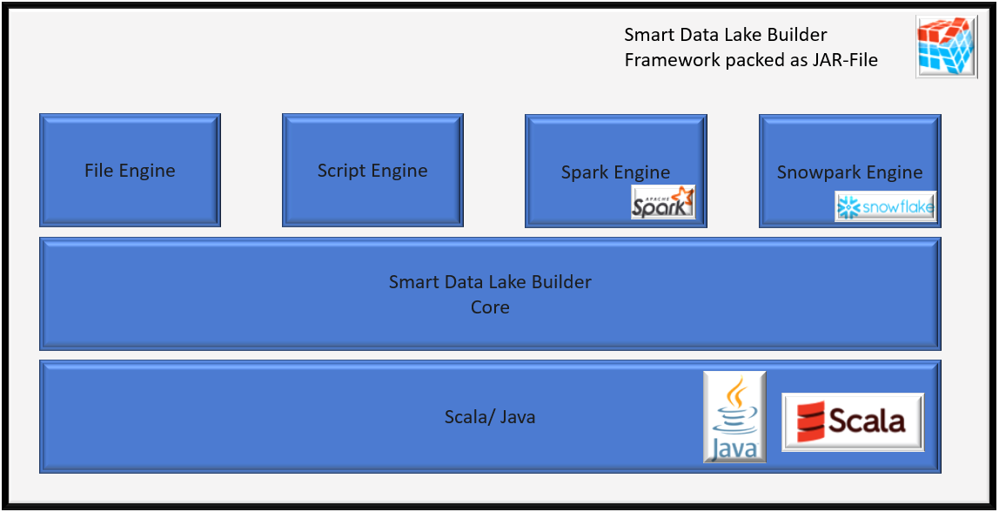

An execution engine is a technology/library used by SDLB to transform data. SDLB supports different execution engines and is able to combine different execution engines in the same data pipeline / job.
The data structure used to transport data between DataObjects and Actions is called a SubFeed.
Each Execution Engine has Subfeeds, Actions and Dataobjects associated with it. 


Currently SDLB supports the following execution engines:

|Category|Execution Engine|SubFeed Name|Engine Connection|Description|Supported Actions|Supported DataObjects|
| ------ | -------------- | ---------- | --------------- | --------- | --------------- | ------------------- |
|Java-Byte-Stream|File Engine|FileSubFeed|-|Transfer Byte-Streams without further knowledge about their content|FileTransferAction, CustomFileAction|all HadoopFileDataObjects, WebserviceFileDataObject, SFtpFileDataObject|
|Generic DataFrame API|Spark Engine|SparkSubFeed|SparkClassicConnection|Transform data with Spark DataFrame API in a Spark session running inside the SDLB process|CopyAction, CustomDataFrameAction, DeduplicateAction, HistorizeAction|all Hadoop/SparkFileDataObject, AccessTableDataObject, AirbyteDataObject, CustomDfDataObject, DeltaLakeTableDataObject, HiveTableDataObject, IcebergTableDataObject, JdbcTableDataObject, JmsDataObject, KafkaTopicDataObject, SnowflakeTableDataObject, SplunkDataObject, TickTockHiveTableDataObject|
|Generic DataFrame API|Spark Connect Engine|SparkConnectSubFeed|SparkConnectConnection|Transform data with the Spark DataFrame API on a **remote** Spark Connect server, without a Spark session inside the SDLB process|CopyAction, CustomDataFrameAction, DeduplicateAction, HistorizeAction|SparkConnectTableDataObject, DeltaLakeTableDataObject, IcebergTableDataObject|
|Generic DataFrame API|Snowflake-Snowpark Engine|SnowparkSubFeed|-|Transform data within Snowflake with Snowpark DataFrame API|CopyAction, CustomDataFrameAction|SnowflakeTableDataObject|
|Script|Script Engine|ScriptSubFeed|-|Coordinate script task execution and notify DataObjects about script results|CustomScriptAction|all DataObjects|

### Engine connections

An Action running with the "Generic DataFrame API" needs an *engine connection*, e.g. a Connection implementing the `EngineConnection` trait.
It tells SDLB which DataFrame engine to use and holds the session configuration for it.

Every such Action selects its engine connection through the attribute `engineConnectionId`. If it is not set, the connection with id `default-engine` is used, so a single connection is enough for most jobs:

```
connections {
  default-engine {
    type = SparkClassicConnection
    master = "local[*]"
    sparkOptions {
      "spark.sql.shuffle.partitions" = "8"
    }
  }
}
```

Leave `master` unset to attach to an existing Spark session provided by the environment, e.g. Databricks, EMR or spark-submit. Set it (e.g. `local[*]`, `yarn`) to let SDLB create the session itself.
The id `default-engine` can be changed with the SDLB parameter `defaultEngineConnectionId`.

Switching the whole job to another engine is a matter of changing the type of that connection, see [Spark Connect Engine](#spark-connect-engine) below.
Use `engineConnectionId` on an Action to deviate from the default, e.g. to run one Action against a different Spark cluster than the rest of the job.

:::info
There is no implicit default: if no engine connection is configured, DataFrame Actions fail with `default-engine not found in instance registry`.
:::

Beside `SparkClassicConnection` and `SparkConnectConnection` there is `ScalaConnection`, a lightweight Spark-free engine working on `ScalaSubFeed`. It is currently used for unit tests and small pipelines and has no DataObjects of its own, so it is not covered further here.

### Spark Connect Engine

[Spark Connect](https://spark.apache.org/docs/latest/spark-connect-overview.html) decouples the client from the Spark cluster: the client builds an unresolved logical plan and sends it to a Spark Connect server, which does all the work.
With the Spark Connect engine, SDLB is a thin client. It no longer needs to be a Spark application itself, which means:

* no Spark session, no Spark driver and no cluster dependencies in the SDLB process, so SDLB starts fast and stays small,
* the SDLB job and the Spark cluster can be upgraded and scaled independently,
* SDLB can run wherever a JVM runs, e.g. as a small container or a serverless function, and still process data on a large cluster.

Configure it as engine connection with the remote URL of the Spark Connect server:

```
connections {
  default-engine {
    type = SparkConnectConnection
    url = "sc://spark-connect-server:15002"
  }
}
```

Additional parameters like tokens can be appended according to the Spark Connect connection string spec, e.g. `sc://host:port/;token=ABCDEFG;user_id=user`.
Options for the remote session can be set with `sparkOptions`.
Operations are tagged with app name, Action id and run id on the server side, so you can trace them back to the SDLB job in the Spark UI.

#### DataObjects

`SparkConnectTableDataObject` provides access to tables of the catalog of the remote server through the normal Spark Table API:

```
dataObjects {
  int-airports {
    type = SparkConnectTableDataObject
    connectionId = default-engine
    table {
      db = "default"
      name = "int_airports"
      primaryKey = [ident]
    }
  }
}
```

It is a transactional table DataObject supporting partitions, schema evolution and `SDLSaveMode.Merge`, so all four DataFrame Actions can be used with it, including [DeduplicateAction](actions/deduplicateAction) and [HistorizeAction](actions/historizeAction).
Note that merge and schema evolution need a table format supporting them on the server side, e.g. delta or iceberg. Use `format` to choose the format when the table is created.

`DeltaLakeTableDataObject` and `IcebergTableDataObject` also work with the Spark Connect engine. They live in sdl-core and delegate to engine-specific implementations discovered on the classpath, so the same DataObject configuration runs on classic Spark or Spark Connect depending on the engine connection.
Everything is done through SQL and the table format's own metadata tables and stored procedures, without the Delta or Iceberg Java API.

#### Limitations

The Spark Connect client has no Hadoop FileSystem access to the data - all data access happens through `spark.read`/`spark.write` on the server side. Therefore:

* no file based DataFrame DataObjects, e.g. CsvFileDataObject or ParquetFileDataObject: reading files into a DataFrame is implemented for classic Spark only. Data must be reachable through the catalog of the remote server. Byte-stream file handling with the File Engine still works, as it needs no Spark session - only CustomFileAction is unavailable, because it distributes work on Spark executors.
* table maintenance which needs the filesystem is skipped: an existing path is neither registered nor converted to Delta/Iceberg format, a table with a missing path is not dropped, and `path` on DeltaLakeTableDataObject is handled server-side only.
* no Hadoop path statistics and no column statistics in `getStats`.
* no Spark stage metrics, as there is no `QueryExecutionListener` on the client side. Metrics come from the table format's operation metrics instead, e.g. Delta or Iceberg snapshot metrics.
* no user defined functions registered from the SDLB configuration, as `SparkConnectConnection` has no `sparkUDFs`/`pythonUDFs`. Register them on the server instead.
* transformers must be engine independent: use `SQLDfTransformer`/`SQLDfsTransformer` or the `ScalaClassGenericDf(s)Transformer`, see [Transformations](transformations). Transformers typed to classic Spark, e.g. `ScalaClassSparkDfTransformer` or the Python transformers, are not available.

:::caution
A classic Spark session and a Spark Connect session cannot coexist in the same JVM, and classic `spark-sql` must **not** be on the classpath of a Spark Connect job - the Spark Connect client (`spark-connect-client-jvm`) provides the same class names.
Build a job for one of the two engines: `sdl-spark` for classic Spark, `sdl-sparkconnect` for Spark Connect. Consequently a single SDLB job cannot combine the Spark and the Spark Connect engine.
:::

### Connecting different execution engines

In order to build a data pipeline using different execution engines, you need a DataObject that supports both execution engines as interface, so that one execution engine can write the data in the DataObject and the other one can read from it.
- from FileSubFeed to SparkSubFeed (and vice-versa): any Hadoop/SparkFileDataObject like ParquetFileDataObject
- from SparkSubFeed to SnowparkSubFeed (and vice-versa): SnowflakeTableDataObject
- from ScriptSubFeed to any (and vice-versa): every DataObject is suitable

SparkSubFeed and SparkConnectSubFeed are the exception: they cannot be combined in the same job at all, as their sessions cannot coexist in one JVM, see [above](#spark-connect-engine). Hand data over through a table read by a separate job instead.

### Schema propagation

Note that a schema can only be propagated within a data pipeline for consecutive actions running with an execution engine of category "Generic DataFrame API". Whenever such an Action has an input from a different category, the schema is read again from the DataObject.

SDLB is able to convert schemas between different execution engines of category "Generic DataFrame API", e.g. Spark and Snowpark.

### Determining execution engine to use in "Generic DataFrame API" Actions

A "Generic DataFrame API" Action can run with different execution engines like Spark or Spark Connect. It determines the execution engine to use in Init-phase as follows:

1. intersect the SubFeed types supported by all inputs and all outputs. If there is no common type an exception is thrown.
2. keep only the SubFeed type of the Action's [engine connection](#engine-connections). If nothing is left an exception is thrown.
3. if the transformers are typed to a specific engine, that type is used and must be part of the remaining types.
4. otherwise the first remaining type in the order of the inputs is chosen.

To check which execution engine was chosen, look for logs like the following:

      INFO  CustomDataFrameAction - (Action~...) selected subFeedType SparkSubFeed

### Execution Engines vs Execution Environments

As mentioned in [Architecture](../../docs/architecture), SDLB is first and foremost a Java (Scala) application.
It can run in any Execution Environment where you can install a JVM, executing Actions with any of its Execution Engines. SDLB chooses the Execution Engines for your data pipeline independently from the Execution Environment that SDLB lives in.
For example: Let's say you run SDLB in a distributed fashion on a Spark Cluster using spark-submit. 
If one of your Actions only has SnowflakeTableDataObjects as input and output, SDLB will run it using the Snowpark-Engine.
In practice, this means that SDLB will connect to the Snowflake Environment from inside your Spark-Cluster and then execute your Action from there using Snowpark's Java/Scala Library.

Of course, the Execution Environment you have influences the DataObjects that you have at your disposal: for instance, if you want to connect to Snowflake, you need a Snowflake account and be able to connect to Snowflake.
But the Execution Environment does not determine the Execution Engines SDLB will use - your DataObjects, Actions, Transformations and [engine connections](#engine-connections) do.


The Spark Connect engine loosens this coupling further: with it SDLB is not a Spark application anymore, so the Execution Environment no longer needs a Spark installation at all.
A small container running the SDLB job is enough, while the data is processed on the Spark Connect server.
