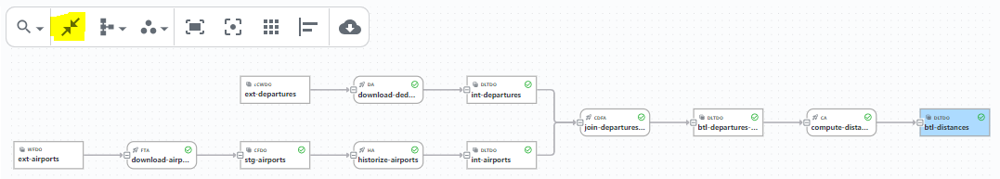

## Goal

SDLB is following a _documentation from metadata and code_ approach. 
In this part, we are going to dive into the role of descriptive metadata in SDLB, and demonstrate how to create this additional metadata and its benefits.
Again it is based on the departures/airports/btl.conf configuration files from the previous steps.

Descriptive metadata, in the context of SDLB, refers to additional configuration attributes, markdown files and generated json files, that go beyond the basic _id_ of DataObjects and Actions.
It is mainly about adding information to document, manage and explore data pipelines effectively in the SDLB UI.

Of course descriptive metadata is not needed to run your data pipeline, but you will see how it will create a nice, up-to-date documentation in the SDLB UI   

## Add metadata for Actions, DataObjects and Transformations

One part of metadata is additional informations for DataObjects, Actions and Transformations. 

Metadata for __Actions__ can include attributes shown in the following example for `join-departures-airports`.
We have already seen the `feed` attribute. The `tags` attribute can take a list of arbitrary tags for your Action.
And to write longer `description`s you can use Hocon's multi-line string syntax.
```
    metadata {
      feed = compute
      name = "Airport Departures Join"
      tags = ["merge", "airports", "coordinates"]
      description = """
        Merging flight details and airport locations.
        Join needs to be done for departure and arrival.
      ""
    }
```

Metadata for __DataObjects__ can include attributes shown in the next example for `ext-departures`.
Again `tags` attribute can take a list of arbitrary tags.
`layer` should be a name for the stage of the DataObject in the data pipeline, e.g. extern/stage/integration/btl according to our convention,
or bronze/silver/gold for the Lakehouse approach.
And `subjectArea` can be used to group DataObjects according to topics or business areas.
```
    metadata = {
      name = "Flight Departures Web Download"
      tags = ["aviation", "flight", "departures"]
      layer = "extern"
      subjectArea = "flight data"
      description = "OpenSky Network flight departures"
    }
```

Metadata for __Transformations__ can be added as `description` attribute in the corresponding configuration,
but it is even nicer to document it right in the code if it is a _ScalaClassSparkDfTransformer_ like `com.sample.ComputeDistanceTransformer`.
See the following _ScalaDoc_ comment already existing in file `src/main/scala/com/sample/ComputeDistanceTransformer.scala`:
```
/**
 * ComputeDistanceTransformer uses method calculateDistanceInKilometer to calculate distance between two GPS coordinates
 * with respect to the earth radius.
 */
class ComputeDistanceTransformer extends CustomDfTransformer {
...
```

To make the Scala documentation available in the UI, the Java command line tool called _ConfigJsonExporter_ 
will export a parsed and enriched configuration as Json file, including code comments. Details follow later in this chapter.

Lets now add some descriptions, tags and other metadata to our configuration files.

## Create comprehensive documentation using markdown files

Additionally, we want to create a comprehensive documentation for DataObject `btl-distance`, as the logic could need some explanation.
For this we will write a separate markdown file. The UI will search markdown files for configuration objects according to the
following path convention: `[dataObjects|actions|connections]/<id>.md`.
Let's edit therefore file `viz/dataObjects/btl-distance.md`.

The existing file already contains some examples to create titles, tables and include images.
And there is an example of a special syntax to create column descriptions using `@column` keyword.
These columns descriptions will be rendered as markdown-table, and are also shown as column comments in the schema.

Lets add an additional comment for column `dep_name` to the markdown.

## Generate schema and statistics metadata

What would be a DataObject configuration viewer without possibility to see structured DataObject schemas.
Using a Java command line tool called _DataObjectSchemaExporter_, schema, table statistics and column statistics can be exported as Json data for SDLB UI.

To start the _DataObjectSchemaExporter_ and also the previously mentioned _ConfigJsonExporter_, execute the following command:
```
./exportConfigSchemaStats.sh
```

:::tip Scheduling export
Export configuration, schema and statistics at least with every release of your data pipelines.
For this you can easily add _ConfigJsonExporter_ and _DataObjectSchemaExporter_ command line tool in the corresponding release pipeline. 
:::

## SDLB UI

Now it's time to see the result in the SDLB UI.
First you need to download the current version of the SDLB Visualizer using the following command:
```
./updateViz.sh
```

Then you can start a Webserver to serve the SDLB UI on port http://localhost:5000 using the following command:
```
./startViz.sh
```

To stop the Webserver press Ctrl-C.

If something doesn't work as expected, you can also have a look at the official [UI Demo](https://ui-demo.smartdatalake.ch/).

Don't forget to check the [lineage graph](https://ui-demo.smartdatalake.ch/#/config/dataObjects/btl-distances/) of the data pipeline that you have created through this tutorial.
To expand all nodes use the _Expand graph_ button as shown in the following screenshot:



:::note
As the local UI deployment is a static web application without backend service, it needs a listing of all state files.

The state index file is updated at the end of each run by appending a line for the new state file.
Therefore, you can see an SDLB run in the local UI only once it finished ordinarily (SUCCESS or FAILED), but not if the corresponding process was killed.

A configuration index file is not needed as we use _ConfigJsonExporter_ command line tool. 
Don't forget to re-run it in order to have configuration changes reflected in the SDLB UI.

Should you need to re-create the state index file, you can use the following commands:
```
pushd viz
./build_index.sh ./state
popd
```
:::

## Summary

The final solution for departures/airports/btl.conf should look like the files ending with `part-3-solution` in [this directory](https://github.com/smart-data-lake/getting-started/tree/master/config).

In conclusion, descriptive metadata together with a flexible UI is the unsung hero of data pipeline management,
enabling teams to organize and document data more efficiently. 

Soon, the SDLB UI will be available also "as-a-service". Stay tuned!