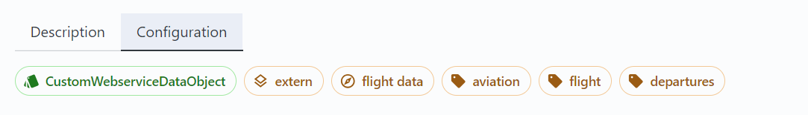
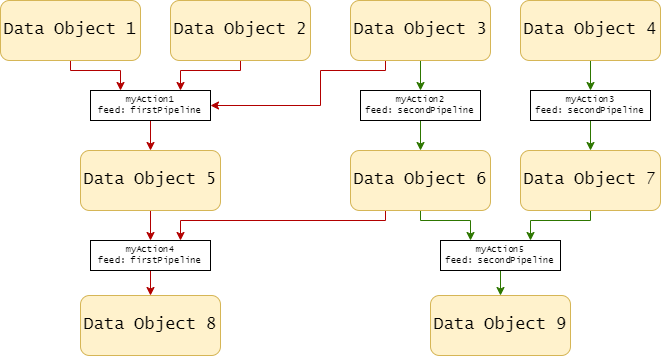

import Tabs from '@theme/Tabs';
import TabItem from '@theme/TabItem';

## Goal

In this part, we are going to dive into the role of metadata in the Smart Data Lake Builder (SDLB) and demonstrates how to define metadata for SDLB objects using the configuration file [solution](../config-examples/application-part3-download-incremental-mode.conf) presented in part 3. Metadata, in the context of Smart Data Lake, refers to additional information that goes beyond the basic name and description of DataObjects and Actions. It includes details such as feeds for Actions, tags associated with the component, and other attributes that help manage and explore data effectively. 

While metadata attributes are optional, they can be very useful in many situations, as it is the case of *feeds* for actions.

## Metadata in DataObject
SDLB has file-based metadata feature, allowing users to provide additional information when defining DataObjects in the configuration file. This serves as more than just documentation, offering a comprehensive understanding and management of DataObjects by providing detailed descriptions, as well as labels for layers, subject areas, and tags

For example, editing metadata for the `ext-departures` data object can be achieved with the following configuration:

```
  ext-departures {
    type = WebserviceFileDataObject
    url = "https://opensky-network.org/api/flights/departure?airport=LSZB&begin=1696854853&end=1697027653"
    readTimeoutMs=200000
    metadata = {
          name = "Flight Departures Web Download"
          description = "OpenSky Network flight departures"
          layer = "extern"
          subjectArea = "flight data"
          tags = ["aviation", "flight", "departures"]
    }
  }
```
:::tip UI Tool
If we check [UI Demo](https://ui-demo.smartdatalake.ch/#/config/dataObjects/ext-departures), the given information in metadata are visualized for `ext-departures`.



For a deeper understanding of our visualization tool, please refer to our [bolg](../../../blog/sdl-uidemo).
:::

## Metadata in Action
* ### Customizable Transformations
In the realm of SDLB, metadata serves as a valuable space for documenting the usage of custom transformations, providing clarity on the intricacies of the data pipeline.
For instance, metadata for action `join-departures-airports` can be:

```
metadata {
          name = "Airport Departures Join"
          description = "merging flight details and airport locations"
          tags = ["merge", "airports", "coordinates"]
          feed = compute
    }
```

* ### Metadata and Feeds
SDLB acknowledges the need to run specific parts of defined pipelines. This is achieved by associating actions with *feeds*, which act as markers for sub-pipelines within a greater pipeline. Feeds inserted into metadata allow the selective execution of actions during development, debugging, or various use cases.

The following example has two feeds:




Feeds are inserted into the metadata as follows:

```
actionName {
  type = actionType
  input = some-input-dataObject
  output = some-output-dataObject
  metadata {
    feed = feedName
  }
}
```

Feeds in metadata are instrumental in selecting the right actions to run. During SDL execution, actions corresponding to certain feeds can be specified. Multiple actions can be associated with the same feed, allowing for more granular control over the execution of the data pipeline.

## Try it out
Now let us experiment with editing metadata for DataObjects and Actions from the [solution](../config-examples/application-part3-download-incremental-mode.conf) in the previous section. Customize metadata based on your understanding of different data, and modify feeds to run parts of the data pipeline selectively. The final configuration file could resemble [this](../config-examples/application-part3-with-meatdata.conf).

In conclusion, metadata is the unsung hero of Smart Data Lake management, enabling organizations to not only organize and process data efficiently but also to ensure data quality and support advanced analytics. With its versatile applications, metadata proves to be a important player in the evolving landscape of data management.