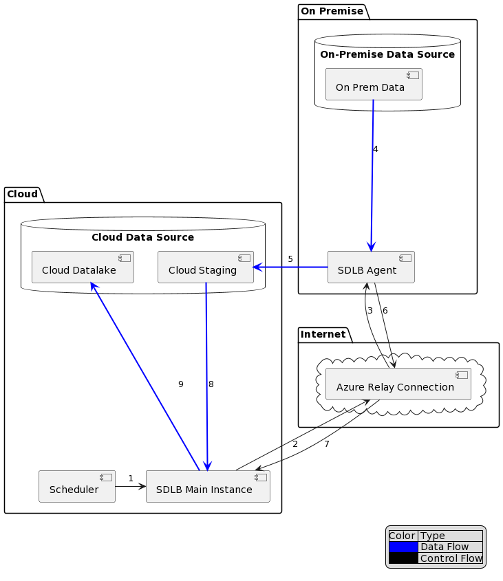

:::info
This feature is Experimental 
:::

## Introduction

The Agent feature allows to have a main instance of SDLB sending instructions to another Instance of SDLB, called the Remote Agent.
This Remote Agent then executes the action in its environment and returns the schema of the resulting data in an empty SparkSubFeed.
Only metadata is sent over the connection between Remote Agent and Main Instance.
The Main Instance then fetches the result if needed using its own connection to the Data.

A possible workflow using Azure Relay Service (which will be used in the example below) is illustrated in the following figure:
<!-- Source located under ../puml/agents-example.puml -->


1. SDLB Main instance is started (either ad hoc or by a scheduler) and wants to execute an Action for which agentId is specified
2. Main Instance wants to send instructions to remote Agent. It connects to Azure Relay Service
3. SDLB Agent reveives instructions 
4. SDLB Agent executes Action remotely. Goal of the action: Copy from On-Premise Data-Source to cloud. Get data from On-Premise Data-Source
5. SDLB Agent executes Action remotely: Copy Data to the Cloud via On-Premise connection
6. SDLB Agent finished execution Action and sends back schema of output DataObject
7. SDLB Main Instance reveives schema of output DataObject
8. SDLB Main Instance accesses Data of DataObject from Cloud connection
9. SDLB Main Instance executes the next Action, which uses the Data from Cloud Staging and stores results in Cloud Storage

## Agent Config

To use this feature, you must define a section called agents in your HOCON config.
This config section allows to describe how to reach your remote agents as well as the connections that the remote agents have.

Example: Agents section defining a JettyAgent along with a private Connection that only the Agent can access.
```
agents {
  agent-dummy {
    type = JettyAgent
    url = "ws://localhost:4441/ws/"
    connections {
      remoteFile {
        id = remoteFile
        type = HadoopFileConnection
        pathPrefix = "target/jetty_agent_dummy_connection"
      }
    }
  }
}
```

Once you have defined your agents, you can reference them in your actions by specifying the field agentId.
In the example above the agentId would be **agent-dummy**.
If you define an agentId in your action, it will be executed on that agent.

More precisely, the Main Instance will send instructions on how to execute the action on the Remote Agent.
These instructions take the form of a string containing all the necessary hocon configuration required to execute the Action.
The instructions contain the Action's config along with all Input and Output DataObjects of the action. 
That's all that the Agent knows, it does not get any other context when it is started.

Usually, some of these DataObjects will be linked to connections that are only available on the instance where the Agent lives, for example, a private Database Connection so that the Remote Agent can fetch Data for a DataObject.
Connections defined in the agents section **override** connections defined in the global connections section when they are executed on the Agent.
When the Agent is deployed, it gets the necessary authentication information for these agent connections on startup on the Remote Instance and then just waits for instructions.

## Agents Types

- Simple, unsecured Jetty Websocket for development use
- Azure Relay service (requires sdl-azure and an Azure subscription with a Relay that has a Hybrid Connection). The traffic between the Agent and the Remote Instance in protected by AzureRelayService. The main instance needs to know a SharedAccessKey in order to connect to the Remote Agent via the AzureRelay.

## Limitations
Only DataObjects that return SparkSubfeeds are currently supported.

