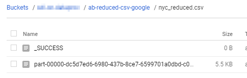

:::warning
This page is under review and currently not visible in the menu.
:::

Smart Data Lake can be executed on the Google Cloud platform using their Dataproc service.
The following steps will show you how to set everything up and start a first data load.

1. Create a new Storage Bucket to hold the jar file and any input / output of your feeds.
    We'll also store the application.conf in the same bucket.

2. Build the project (with activated profile fat-jar) if you haven't done that already,
    then upload the smartdatalake-&ltversion&gt-jar-with-dependencies.jar to the bucket. The easiest way is through the Cloud Console.


1.  Also copy yor application.conf to the bucket that way.

    For a simple test that loads from your Google Storage bucket and writes back to it, you can use the following sample application.conf:
    ```hocon
    dataObjects {
      ab-csv-google {
        type = CsvFileDataObject
        path = "gs://yourbucketname/AB_NYC_2019.csv"
      }
      ab-reduced-csv-google {
        type = CsvFileDataObject
        path = "gs://yourbucketname/~{id}/nyc_reduced.csv"
      }
    }
    
    actions { 
      loadGoogle2Google {
        type = CopyAction
        inputId = ab-csv-google
        outputId = ab-reduced-csv-google
        metadata {
          feed = ab-google
        }
      }
    }
    ```        
    Make sure to replace `yourbucketname` in the data objects ab-csv-google and ab-reduced-csv-google with your real bucket name.
    As you can see in the examples, you can use the prefix gs:// directly to point to files in a Google Storage bucket.

1.  To run the sample feed, also copy the example resource file AB_NYC_2019.csv to the buckets root directory.

    At this point you should have three files in your bucket: the jar, the application.conf and the csv file.

1.  Create a new Dataproc Cluster.
    Choose a configuration that matches your needs.
    While you can basically use any configuration for Cluster Mode (even "Single Node" with 1 master and 0 workers),
    the master node should not be too small so chose at least a n1-standard-4.
    Anything lower might result in errors, even for small jobs.

    Make sure you use the latest Cloud Dataproc image (latest tested version is 1.4).

1.  Create a job and start it. Again, the easiest way to start is through the Google Cloud Console.
    ```
    Main class: io.smartdatalake.app.DefaultConfigurableApp
    Arguments: parameters and values on seperate lines, see README
    ```  
    

1.  Click on Submit and wait for the job to finish. If everything worked as expected, your output should have been written to your bucket:

    
