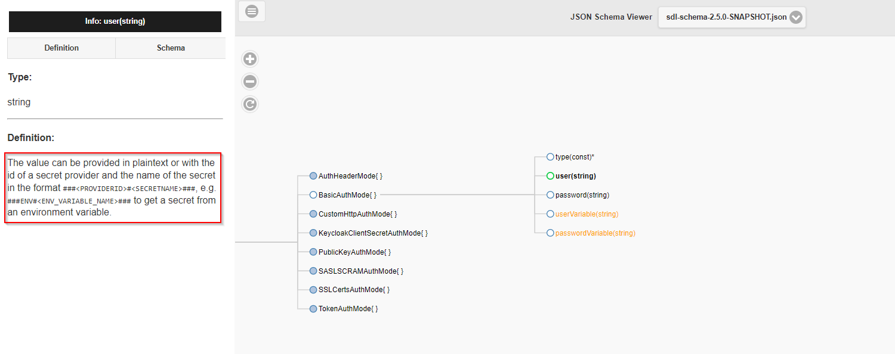

Usernames, passwords and other secrets should *not* be stored in your configuration files *in clear text* as these files are often stored directly in the version control system.
They should also not be visible in logfiles after execution. Secret providers are the secure solutions to work with credentials. 

## Secret Providers (since version 2.5.0)

In version 2.5.0 of SDL, new properties with an improved secret syntax were introduced.
Based on this new syntax, SDL can determine if a secret provider should be used or if the value can
directly be read from the configuration, either as plaintext or from an environment variable.
The actual secret can be selected using the format `###<SecretProviderId>#<SecretName>###`.

In the following snippet, the secrets are retrieved from a secret provider
```
user = "###AZKV#JDBCuser###"
password = "###AZKV#JDBCpw###"
```
while 
```
user = "username"
password = "password123"
```
provides plaintext secret values. To read from environment variables, write
```
user = "${JDBCuser}"
password = "${JDBCpw}"
```
as explained in [Environment variables](hoconVariables#environment-variables).


Whether secret providers can be used for a property can be seen in its description in the 
[Schema Viewer](http://smartdatalake.ch/json-schema-viewer/index.html).
For example:



Implemented secret providers are:

Provider            | Pattern                          |Meaning
--------------------|----------------------------------|---
file                | `###FILE#filename;secretName###` | read `secretName` from file `filename`. The file needs to be a property file with line format `secretName=secretValue`
Azure KeyVault      | e.g. `###AZKV#secretName###`     | Azure KeyVault element `secretName`. KeyValut specified in global section (see below)
Databricks Secret   | e.g. `###DBSECRET#secretName###` | Databricks element `secretName`. Secret provider specified in global section (see below)

Additionaly, custom providers can be implemented, see [Custom Secret Providers](#custom-secret-provider).

## Legacy Secret Providers (deprecated in version 2.5.0)

All configuration items ending with `...Variable`, like BasicAuthMode's `userVariable` and `passwordVariable` can be used with secret providers.
The actual secret can be selected using the format: `<SecretProviderId>#<SecretName>`, e.g.

```
userVariable = "AZKV#JDBCuser"
passwordVariable = "AZKV#JDBCpw"
```


Implemented secret providers are:

Provider            |Pattern    |Meaning
--------------------|-----------|---
clear text          | `CLEAR#pd`|The secret will be used literally (cleartext). This is only recommended for test environments.
environment variable| `ENV#pd`  |The value for this secret will be read from the environment variable called "pd".
file                |`FILE#filename;secretName`| read `secretName` from file `filename`. The file needs to be a property file with line format `secretName=secretValue`
Azure KeyVault      | e.g. `AZKV#secretName`| Azure KeyVault element `secretName`. KeyValut specified in global section (see below)
Databricks Secret   |e.g. `DBSECRET#secretName`| Databricks element `secretName`. Secret provider specified in global section (see below)

## Secret Provider Configuration

#### Azure KeyVault configuration

An [Azure KeyVault](https://docs.microsoft.com/en-us/azure/key-vault/general/) would be specified as follows, here using an ID `AZKV`. The KeyVault name still needs to be specified.
```
global = {
  secretProviders = {
    AZKV = {
      className: io.smartdatalake.util.azure.AzureKeyVaultSecretProvider
      options = {
        keyVaultName: <azure-key-vault-name>
      }
    }
  }
 }
 ```

#### Databricks Secret configuration

Using Databricks credentials and other values can be stored encrypted as [Databricks secrets](https://docs.databricks.com/security/secrets/index.html). This can be used within SDLB by utilizing the class DatabricksSecretProvider. Here the ID `DBSECRETS` is used for further SDLB configuration references. Further, the [secret scope](https://docs.databricks.com/security/secrets/secret-scopes.html) (here `scope=test`) is required in Databricks. The configuration would look like:
```
global {
  secretProviders {
    DBSECRETS = {
     className = io.smartdatalake.util.secrets.DatabricksSecretProvider
     options = { scope = test }
    }
  }
}
```

## Custom Secret Provider
Furthermore, a custom secret provider could be implemented as class using the trait SecretProvider and a constructor with parameter `options: Map[String,String]`.
The specification in the global section would in general look like:

```
global {
  secretProviders {
    <secretProviderId> = {
     className = <fully qualified class name of SecretProvider>
     options = { <options as key/value> }
    }
  }
}
```
