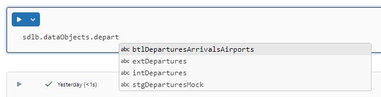

SDLB can also be used in Notebooks. On one side SDLB can provide a high-quality catalog of data objects, and on the other hand it helps to easily prototype transformations in an interactive Notebook environment, and then transfer them to repository for production use.

This page describes configuration of the project, installation in Databricks Notebooks and shows some examples.

## DataObject and Action Catalog
By taking advantage of Notebooks Scala code completion functionalty, one can access DataObjects and Actions from the SDLB configuration in a Notebook like a catalog. This requires generating a corresponding catalog class with a variable for each DataObject and Action.

SDLB includes the LabCatalogGenerator command line tool, which can generate the corresponding Scala code. The generated code is compiled in a second compile phase and added to the dl-pipelines.jar. The LabCatalogGenerator can be activated by the following Maven Profile `generate-catalog` (to be added to the project pom.xml) when executing maven `package` command:

```xml
<profile>
    <id>generate-catalog</id>
    <build>
        <plugins>
            <!-- generate catalog scala code. -->
            <plugin>
                <groupId>org.codehaus.mojo</groupId>
                <artifactId>exec-maven-plugin</artifactId>
                <version>3.1.0</version>
                <executions>
                    <execution>
                        <id>generate-catalog</id>
                        <phase>prepare-package</phase>
                        <goals>
                            <goal>java</goal>
                        </goals>
                        <configuration>
                            <mainClass>io.smartdatalake.lab.LabCatalogGenerator</mainClass>
                            <arguments>
                                <argument>--config</argument>
                                <argument>./config</argument>
                                <argument>--srcDirectory</argument>
                                <argument>./src/main/scala-generated</argument>
                            </arguments>
                            <classpathScope>compile</classpathScope>
                        </configuration>
                    </execution>
                </executions>
            </plugin>
            <!-- Compiles Scala sources incl. generated catalog -->
            <plugin>
                <groupId>net.alchim31.maven</groupId>
                <artifactId>scala-maven-plugin</artifactId>
                <executions>
                    <!-- add additional execution to compile generated catalog (see id generate-catalog) -->
                    <execution>
                        <id>compile-catalog</id>
                        <phase>prepare-package</phase>
                        <goals>
                            <goal>compile</goal>
                        </goals>
                        <configuration>
                            <sourceDir>./src/main/scala-generated</sourceDir>
                        </configuration>
                    </execution>
                </executions>
            </plugin>
        </plugins>
    </build>
</profile>
```

The LabCatalogGenerator creates source code for class `ActionCatalog` and `DataObjectCatalog` in package `io.smartdatalake.generated`. These names can be customized by command line parameters. The directory for the generated source code has to be provided as `srcDirectory` parameter.

Once generated, the fat-jar (created with maven profile `fat-jar`) and SDLB configuration files have to be uploaded into a Databricks Volume. Then create a Databricks Cluster with the fat-jar as Library and Environment Variable `JNAME=zulu17-ca-amd64` to use Java 17.

Make your SDLB data pipeline did run at least once, so that tables are existing. A simple Databricks Job configuration can look as follows:


Create a Databricks Notebook and add the following code into the first cell to initialize SDLB Lab:
```scala
import io.smartdatalake.generated._
import io.smartdatalake.lab.SmartDataLakeBuilderLab
val sdlb = SmartDataLakeBuilderLab[DataObjectCatalog, ActionCatalog](
  spark,
  Seq("/Volumes/<catalog>/test/test-vol/application.conf"),
  DataObjectCatalog(_, _), ActionCatalog(_, _)
)
```

Now the DataObject and Action catalog can be used as follows:



## Using DataObjects
The functions of a DataObject have been adapted for interactive use in notebooks via a corresponding wrapper. The following functions are available for Spark-DataObjects (other types have not yet been implemented):
- get(): DataFrame, optionally filtered to topLevelPartitionValues.
- getWithPartitions(): Get DataFrame filtered via multi-level PartitionValues (Seq[Map[String,String]))
- write(): Write DataFrame - disabled by default because DataObjects should be written via pipelines. To enable it, - SmartDataLakeBuilderLab.enableWritingDataObjects=true must be set.
- writeWithPartitions(): Overwrite DataFrame for defined partitions. Disabled by default, see also comment on write().
- dropPartitions() / dropTopLevelPartitions() / dropTopLevelPartition()
- infos(): returns a map with the most important information and statistics
- partitionColumns()
- partitions()
- topLevelPartitions()
- partitionModDates(): maximal Filedatum pro Partition
- schema
- printSchema()
- refresh(): Short form for session.catalog.refreshTable() to update the tables/file information that Spark may have cached
- dataObject: Access to the original SDP DataObject object

*Pros*:
- a DataObject can simply be queried and the common operations can be easily performed on it.
- the location and table name no longer need to be maintained in notebooks. This allows for easy renaming and migrations, and support for branching in the future.

## Using Actions, Writing Transformations
Functions for working with actions have also been adapted for interactive use in notebooks via a corresponding wrapper, these are mainly aimed at adapting, replacing or developing transformations. The following features are available on a Spark action:
- buildDataFrames(): Returns a builder that can be used to fetch filtered and transformed DataFrames of the action, see below.
- getDataFrames(): Can do the same as buildDataFrames(), but it has to be configured in a parameter list, which is often less convenient.
- simulateExecutionMode(): The ExecutionMode defines what data the action will process the next time it runs. The function simulates the call to the Action's ExecutionMode and returns the corresponding result.

The DataFrame builder (buildDataFrames method) helps filter the input dataframes and apply the transformation of an action. To - do this, it offers the following methods:
- withPartitionValues(): Input-DataFrames mit Partition Values filtern.
- withFilter(): Filter input dataframes with any filter condition if the corresponding column exists.
- withFilterEquals(): Filter input dataframes with an equals condition if the appropriate column exists.
- withoutTransformers(): return input dataframes and do not apply any transformations.
- withLimitedTransformerNb(): Only apply a certain number of Transformers.
- withReplacedTransformer(): Replace a specific transformer with another, e.g. to test a bugfix. The transformer to be replaced is indicated by the corresponding index number (0 based).
- withAdditionalTransformer(): Add an additional transformer at the end of the transformer chain.
- get/getOne(): fetch the DataFrames prepared by the builder. This function completes the builder process, up to which point the - previously mentioned methods can be called as many times as you like.
- getOne can be used to return a single DataFrame - if this is not unique, an appropriate name can be specified for selection.

Example: build output DataFrames of `join-departures-airports` Action (see getting-started for details) with a filter to reduce rows for debugging
```scala
val dfs = sdlb.actions.joinDeparturesAirports
.buildDataFrames
.withFilter("dl_ts_captures", $"dl_ts_captures">"2024-04-02")
.get
```

:::info
The DataFrame builder of an action can only access DataFrames that originate from an Input-DataObject of the action, or are created by a transformer in the chain.
If a new Input-DataObject is required, the action configuration in the configuration files must be adapted and the initialization cell must be rerun.
See section below for developing new actions for an easier method.
:::

## Define a new Transformers:

To create a new transformer, simply derive a new class from CustomDfsTransformer (or CustomDfTransformer for 1:1 actions, e.g. CopyAction), and then add it with withAdditonalTransformer in the DataFrame builder

```scala
import org.apache.spark.sql.DataFrame
import io.smartdatalake.workflow.action.spark.customlogic.{CustomDfsTransformer, CustomDfTransformer}
import org.apache.spark.sql.functions._
class MyTransformer extends CustomDfsTransformer {
  def transform(dfBtlDistances: DataFrame): DataFrame = {
    dfBtlDistances.withColumn("test",lit("hello"))
  }
}
```

## Develop a new Action
If a new action/transformation has to be developed, there is no corresponding starting point in the action catalog yet.
So, in order to develop a new transformation directly on the catalog, the SmartDataLakeBuilderLab class also provides a corresponding DataFrame builder. It has similar methods to those listed above, but can access all DataObjects from the DataObjects catalog. MyTransformer defined above can be used as follows:
```scala
sdlb.buildDataFrames.withTransformer(new MyTransformer).getOne.show
```

## Summary
SDLB provides a nice coding interface for Notebooks to find and access DataObjects, and debug existing or implement new Actions.