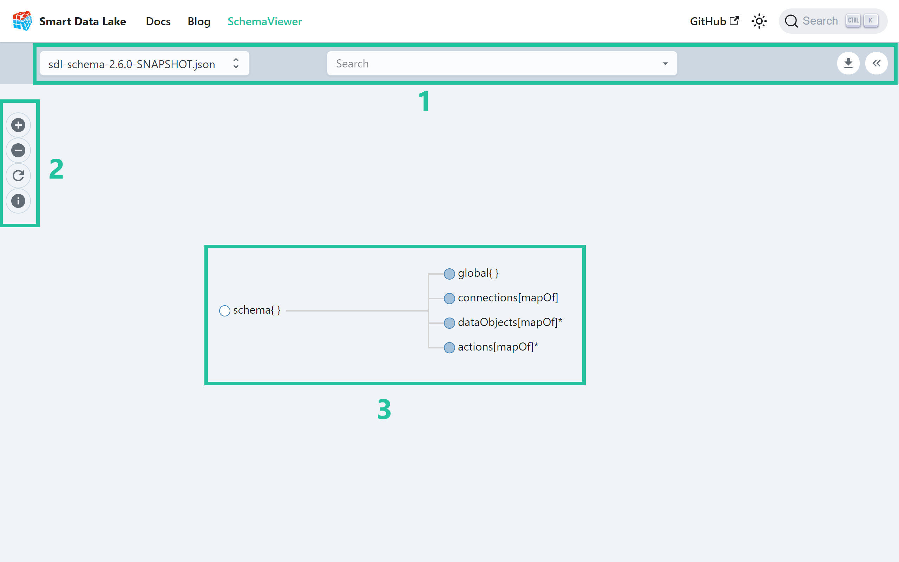
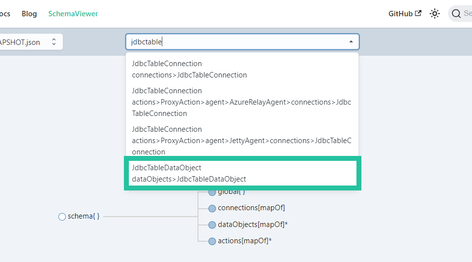
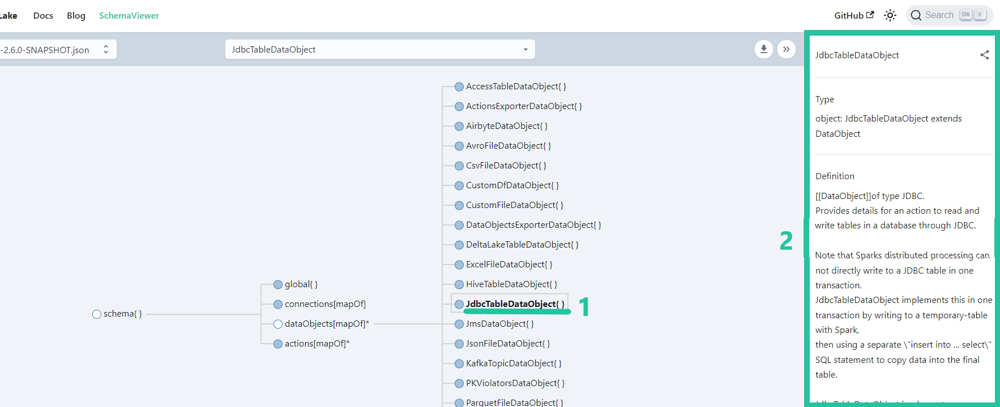

In this section, we will guide you on navigating the [Schema Viewer](https://smartdatalake.ch/json-schema-viewer/), a powerful tool designed to help you understand the structure and relationships of the SDLB API. Additionally, we will delve into the process of mapping the schema logic to the configuration file, allowing you to effectively write SDLB pipelines.

## What is Schema Viewer?
The Schema Viewer serves as a fundamental instrument for schema exploration. The primary aim of the Schema Viewer is to facilitate the process of identifying and exploring `dataObjects` and `actions` within the SDLB API. It empowers users to search for specific data structures, comprehend their relationships, and obtain a comprehensive overview of the available data types, properties, and their interconnections.

Understanding the relationships between various schema elements is crucial for building comprehensive SDLB pipelines. The Schema Viewer provides visual representations and navigation options that make it easier to see how different elements are connected, helping you design your data pipeline efficiently.

Another key functions of the Schema Viewer is to help you map the schema logic to your configuration files. By visualizing the configuration schema, you can identify the appropriate elements and their properties, streamlining the process of creating configuration files for SDLB pipelines.

## User interface
In the Schema Viewer, the user interface is comprised of three main elements, each serving a distinct purpose to enhance your experience and efficiency.



1. **Top Bar**: The Schema Viewer's top bar hosts a crucial feature—the schema version selection drop-down. This feature allows you to effortlessly switch between different versions of the displayed configuration schema. The search bar is another powerful functionality. It simplifies the process of locating specific elements or relationships within your schema. It's a time-saving tool that helps you pinpoint the exact data you're looking for. Finally, for those who need to work with the schema data in a more flexible format, the 'Download' button, also found in the top bar, is really helpful. With a single click, you can obtain the schema in JSON format, making it easy to read it in a Scala or Python script.
2. **Action Bar**: The Action Bar provides user-friendly zoom controls, allowing you to zoom in for a closer examination of schema details or zoom out for a broader overview. There are times when you might navigate the schema in great detail, and the 'Reset' button in the Action Bar acts as your convenient escape hatch. It ensures that, with a simple click, you can easily return to the default view, helping you regain your bearings when necessary. In the Action Bar, you'll also find a schema elements [legend](#legend). This handy reference guide deciphers the various icons and colors used to represent schema elements.
3. **Schema Browser**: Here, you'll encounter a visual representation of the configuration schema you're working with. This central hub brings the schema to life, presenting it in a structured and intuitive manner.

### Legend
| Element        	| Description 	|
|----------------	|-------------	|
| ⚪️ Expanded       	|   Elements with a white bullet in the schema represent leaf nodes in the navigation tree and cannot be expanded further.          	|
| 🔵 Collapsed      	|  Items indicated by a blue bullet in the schema can be expanded by clicking on the bullet to reveal more information or sub-elements.           	|
| ⚪️ Required*      	|    Elements containing an asterisk (`*`) in their name are mandatory and need to be included in the config file.        	|
| 🔵 Object{}       	|  The `Object` type is an element that contains other parameters grouped together and is mentioned in the schema browser with braces `{}`. You'll find an example in the next section.   	|
| 🔵 Array[type]    	|  The `Array` element is a list containing other elements of a specific type e.g. strings, integers or objects. Square brackets `[]` are used to display array types in the schema browser. You'll find an example in the next section.              	|
| ⚪️ Property(type) 	|   Properties, denoted with parentheses `()` are elements that contain data of a specific type e.g. string, boolean, integer, enumerations etc.        	|
| ⚪️ <span style='color: orange'>Deprecated</span>     	|    Deprecated elements, while no longer recommended for use, still exist for backward compatibility with older systems or applications. Migration of deprecated elements is advised, as they may potentially be removed in newer versions, posing a risk to continued compatibility.        	|

## Navigate the schema browser
The Schema Browser offers two intuitive methods for navigation. First, you can easily search for a specific schema element using the search bar in the top bar. Simply enter the name or keyword of the element you're looking for, and the viewer will swiftly pinpoint and highlight the relevant part of the schema.



Once you've made a selection from the search results, the Schema Browser will automatically expand to reveal the corresponding schema object. Simultaneously, it will display informative contextual text associated with the selected element. This feature ensures that you not only find the element you were looking for but also gain a deeper understanding of its purpose and functionality, all within a single interaction.

Alternatively, you can navigate the Schema Browser by interacting directly with the visual representation. Each schema element is denoted by a bullet. By clicking on the blue bullets, you can easily expand the tree structure to reveal the hierarchical relationships. Clicking (1) on the bullet text (e.g. JdbcTableDataObject) triggers the immediate display of the corresponding schema information (2).



## Mapping schema to config file

Generally speaking you can take this as a reference, the naming convention for elements in the configuration file generally mirrors the nomenclature of the elements in the schema browser, with some notable omissions. These omissions include the element specifications such as `{}`, `[mapOf]`, `[oneOf]`, `[]`, or `(type)`. Let's delve into the specifics of each element designation.

When an element's name concludes with `{}`, it signifies an object capable of possessing properties and nested elements that require a designated key.

Example from schema browser (schema{}->global{}):
```
global {
  spark-options {
    "spark.sql.shuffle.partitions" = 2
    "spark.databricks.delta.snapshotPartitions" = 2
  } # this a the nested element in global
  synchronousStreamingTriggerIntervalSec = 2 # this is a property of global{}
}

...

```

Elements denoted by names ending in `[mapOf]` indicate the existence of a map, specifically a key-value pair of distinct sub-elements, with the element itself lacking any properties.

Example from schema browser (schema{}->dataObjects[mapOf]*):
```
dataObjects {
  ext-departures {
    type = WebserviceFileDataObject
    url = "https://opensky-network.org/api/flights/departure?airport=LSZB&begin=1696854853&end=1697027653"
    readTimeoutMs=200000
  } # first key-value pair

  ext-airports {
    type = WebserviceFileDataObject
    url = "https://davidmegginson.github.io/ourairports-data/airports.csv"
    followRedirects = true
    readTimeoutMs=200000
  } # second key-value pair
}

...

```
It is worth noting that the `WebserviceFileDataObject` element appears twice, each time with distinct keys. Initially, it is employed for downloading departure dates, and subsequently for acquiring airport information data.

In contrast to `[mapOf]` elements, elements marked by `[oneOf]` can only accommodate a single nested element. These elements function as a specialized type of property, demanding the inclusion of one specific sub-element.

Example from schema browser (schema{}->actions[mapOf]*->CopyAction{}->executionMode[oneOf]):

:::info 
There is a special property called (const). It is found on the type property of an object.  This particular property is required to contain the class name of the parent element e.g. CopyAction. 
:::
```
actions {
  select-airport-cols {
    type = CopyAction # special property of type (const)
    executionMode = { type = DataObjectStateIncrementalMode } # [oneOf] element executionMode containing the nested element of type DataObjectStateIncrementalMode
    ...
  }
}

...

```


Arrays or lists use the square brackets notation `[]` in an elements name. They are used for example in the transformer element for creating transformation pipelines that are processed sequentially. 

Example from schema browser (schema{}->actions[mapOf]*->CustomDataFrameAction{}->transformers[]):
```
actions {
  join-departures-airports {
    type = CustomDataFrameAction
    inputIds = [int-departures, int-airports]
    outputIds = [btl-departures-arrivals-airports]
    transformers = [{
      type = SQLDfsTransformer
      code = {
        btl-connected-airports = """
          select int_departures.estdepartureairport, int_departures.estarrivalairport,
            airports.*
          from int_departures join int_airports airports on int_departures.estArrivalAirport = airports.ident
        """
       }
      },
      {
        type = SQLDfsTransformer
        code = {
          btl-departures-arrivals-airports = """
            select btl_connected_airports.estdepartureairport, btl_connected_airports.estarrivalairport,
              btl_connected_airports.name as arr_name, btl_connected_airports.latitude_deg as arr_latitude_deg, btl_connected_airports.longitude_deg as arr_longitude_deg,
              airports.name as dep_name, airports.latitude_deg as dep_latitude_deg, airports.longitude_deg as dep_longitude_deg
            from btl_connected_airports join int_airports airports on btl_connected_airports.estdepartureairport = airports.ident
          """
        }
      }
    ] # transformer array element containing two SQLDfsTransformer elements

    ...


  }
}

...

```


Finally, elements ending with `(type)`  denote properties that contain values of a predetermined type, such as string, integer, or other specified data types.


Example from schema browser (schema{}->actions[mapOf]*->CustomDataFrameAction{}->type(const)/name(string)):
```
actions {
  join-departures-airports {
    type = CustomDataFrameAction
    inputIds = [int-departures, int-airports]
    outputIds = [btl-departures-arrivals-airports]
    transformers = [{
      type = SQLDfsTransformer # special property type of type (const)
      name = "First transformer" # simple property of type (string)
      ... 
      },
      ...
    ] 
  }
}

...

```