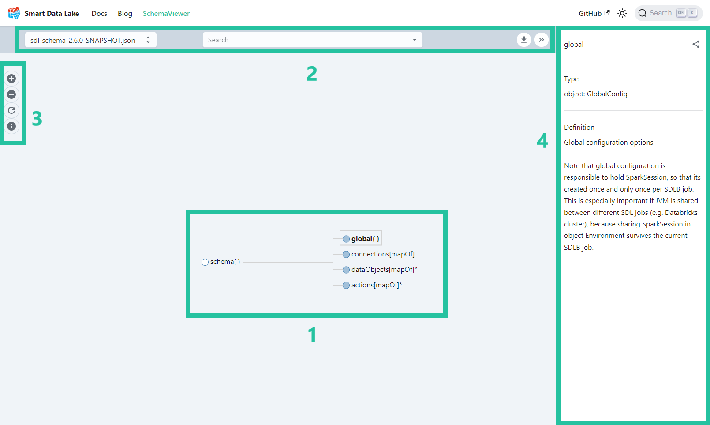

In this section, we will guide you on navigating the [Schema Viewer](https://smartdatalake.ch/json-schema-viewer/), a powerful tool designed to help you understand the structure and relationships of the SDLB API. Additionally, we will delve into the process of mapping the schema logic to the configuration file, allowing you to effectively write SDLB pipelines.

## User Interface
In the Schema Viewer, the user interface is comprised of three main elements, each serving a distinct purpose to enhance your experience and efficiency.

1. **Top Bar**: The Schema Viewer's top bar hosts a crucial feature—the schema version selection dropdown. This feature allows you to effortlessly switch between different versions of the displayed API schema. The search bar is another powerful functionality. It simplifies the process of locating specific elements or relationships within your schema. It's a time-saving tool that helps you pinpoint the exact data you're looking for. Finally, for those who need to work with the schema data in a more flexible format, the 'Download' button, also found in the top bar, is really helpful. With a single click, you can obtain the schema in JSON format, making it easy to read it in a Scala or Python script.
2. **Action Bar**: The Action Bar provides user-friendly zoom controls, allowing you to zoom in for a closer examination of schema details or zoom out for a broader overview. There are times when you might navigate the schema in great detail, and the 'Reset' button in the Action Bar acts as your convenient escape hatch. It ensures that, with a simple click, you can easily return to the default view, helping you regain your bearings when necessary. In the Action Bar, you'll also find a schema elements [legend](#legend). This handy reference guide deciphers the various icons and colors used to represent schema elements.
3. **Schema Browser**: Here, you'll encounter a visual representation of the API schema you're working with. This central hub brings the schema to life, presenting it in a structured and intuitive manner.

### Legend
| Element        	| Description 	|
|----------------	|-------------	|
| ⚪️ Expanded       	|   Elements with a white bullet in the schema represent leaf nodes in the navigation tree and cannot be expanded further.          	|
| 🔵 Collabsed      	|  Items indicated by a blue bullet in the schema can be expanded by clicking on the bullet to reveal more information or sub-elements.           	|
| ⚪️ Required*      	|    Elements containing an asterisk (`*`) in their name are mandatory and need to be included in the config file.        	|
| 🔵 Object{}       	|  The `Object` type is an element that contains other parameters grouped together and is mentioned in the schema browser with braces `{}`. You'll find an example in the next section.   	|
| 🔵 Array[type]    	|  The `Array` element is a list containing other elements of a specific type ex. strings, integers or objects. Square brackets `[]` are used to display array types in the schema browser. You'll find an example in the next section.              	|
| ⚪️ Property(type) 	|   Properties, denoted with parentheses `()` are elements that contain data of a specific type ex. string, boolean, interger, enumerations etc.        	|
| ⚪️ Deprecated     	|    Deprecated elements, while no longer recommended for use, still exist for backward compatibility with older systems or applications. Migration of deprecated elements is advised, as they may potentially be removed in newer versions, posing a risk to continued compatibility.        	|
<!-- TODO add link to the example for object and array  --> 

## Navigate the schema browser
The Schema Browser offers two intuitive methods for navigation. First, you can easily search for a specific schema element using the search bar in the top bar. Simply enter the name or keyword of the element you're looking for, and the viewer will swiftly pinpoint and highlight the relevant part of the schema.

Once you've made a selection from the search results, the Schema Browser will automatically expand to reveal the corresponding schema object. Simultaneously, it will display informative contextual text associated with the selected element. This feature ensures that you not only find the element you were looking for but also gain a deeper understanding of its purpose and functionality, all within a single interaction.

Alternatively, you can navigate the Schema Browser by interacting directly with the visual representation. Each schema element is denoted by a bullet. By clicking on the blue bullets, you can easily expand the tree structure to reveal the hierarchical relationships. Clicking (1) on the bullet text (ex. JdbcTableDataObject) triggers the immediate display of the corresponding schema information (2).

