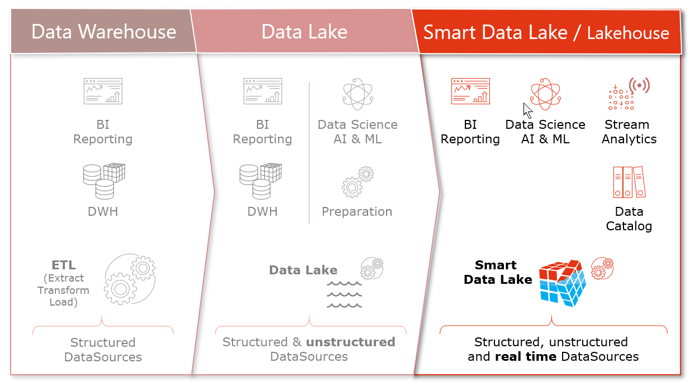
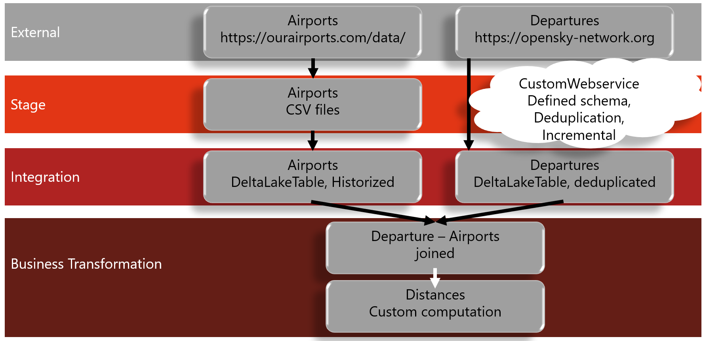
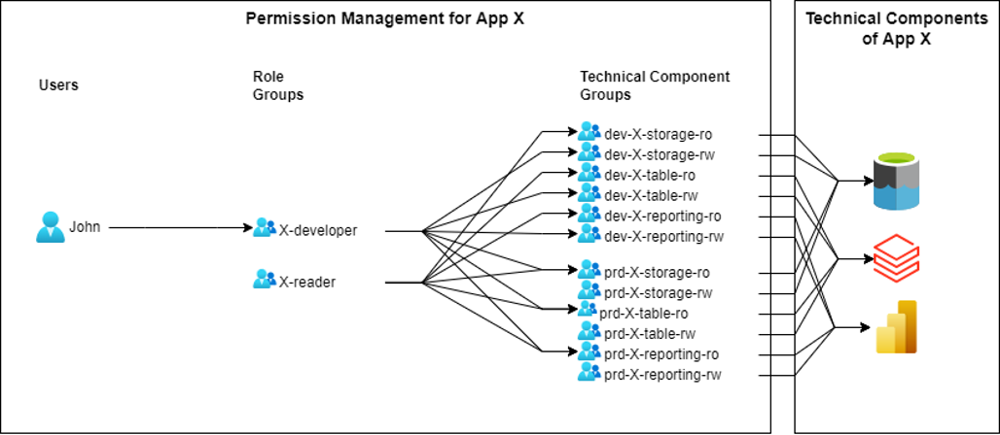

# Smart Data Lake Builder Hands-On Training

<!-- 
Tools: In Teams annotation can be used to point to specific aspects in the configs, SchemaViewer,...
-->

## Goal
* train loving friend imagine to replace short distant flights with train rides
* discover/count all flights which 
  - starting from a certain airport 
  - <500km
  - assume destination airport Bern (LSZB) or Frankfurt (EDDF)


* as data engineers we need to:
  - download data
  - combining/filter/transform data in a general manner
  - store processed data, thus it can be utilized for various use cases
  - analyse/compute data for a specific application

## Smart Data Lake vs. Smart Data Lake Builder

|Smart Data Lake | Smart Data Lake Builder |
|----------------|-------------------------|
| **Concept**    | **Tool**                |
| combines advantages of Data Warehouse and Data Lakes | ELCA's tool to build Data Pipelines efficiently |
| structured data / schema evolution | portable and automated |
| layer approach / processes / technologies | features like historization, incremental load, partition wise |
| Similar to Lakehouse | Open Source on Github: [smart-data-lake](https://github.com/smart-data-lake/) |

## Why Smart Data Lake?
* similar to Lakehouse concept
* combining the flexibility of Data Lakes with the advantages of Data Warehouses
Let's have a closer look.

### Data Warehouse
  - :heavy_plus_sign: preface preparation, structuring and securing data for high quality reporting
  - :heavy_minus_sign: slow changes, less flexible
  - :heavy_minus_sign: no horizontal scaling
  - :heavy_minus_sign: high license cost, expensive
  - :heavy_minus_sign: no unstructured data processing
  - :heavy_minus_sign: insufficient integration of AI
### Data Lake
  - :heavy_plus_sign: performant and flexible
  - :heavy_plus_sign: scalable, open source
  - :heavy_plus_sign: unstructured and complex data structures
  - :heavy_minus_sign: siloed initiatives, redundancy
  - :heavy_minus_sign: heavy data preparation for every use case

### Smart Data Lake aka. Lakehouse
  - :heavy_plus_sign: value & semantic oriented
  - :heavy_plus_sign: known data quality
  - :heavy_plus_sign: secured, handled privacy
  - :heavy_plus_sign: Metadata (data catalog & linage)
  - :heavy_plus_sign: automation, unified batch and streaming
  - :heavy_plus_sign: AI ready



### Why Smart Data Lake Builder (SDLB)?
* examples of other tools: Snowflake - DBT, Azure Data Factory, Apache Beam, …
  - able to use Smart Data Lake concepts
  - different advantages and disadvantages for building data pipelines
* dynamic creation of workflow (no specification of step ordering)
* No Code for easy tasks
* complex data pipelines well suited
* already implemented loading modes (incremental, partition-wise, streaming, checkpoint/recovery)
* already implemented transformations (historize, de-duplication)
* Designed to add custom connectors and transformations
* various data formats, incl. DeltaLake
* Lineage and Data Catalog from metadata
* DevOps ready: version-able configuration, support for automated testing
* early validation
* scripted -> portable can run on most (maybe any) cloud or on-prem platform
* configuration templates allows reuse of configuration blocks

## Data structuring
Within Smart Data Lake we structure our data in layers

* stage layer 
  - copy of the original data, accessible for merging/combining with existing/other data sources
* integration layer 
  - cleaning/structuring/prepared data
* business transformation layer
  - ready for data analysts/scientists to run/develop their applications

In our case we could think of the following structure:



## Security In Cloud
* typically data need to be protected against unwanted access and modification, especially in the cloud, where data is by default accessible from everywhere (from everyone, if mis-configured)
* Data Classification: Public, Internal, Restricted, Personal Data, Confidential
  - various security measures per class, including (not the full list):
    + access control
      * strong authentication
      * periodic review of permissions
    + cryptography
      * encrypt at rest and in transit
      * elaborated secret stores, for key management
    + operations security
      * documentation and automation (CD), change management
      * separated environments with configuration and capacity management
    + ...
    + [ELCAs Cloud Security Concept](https://confluence.svc.elca.ch/display/BL9CONFLUENCE/Data+Security+Concept+for+Cloud+Analytics+Platforms)

  - separate treatment of Personally Identifiable Information (PII)
    + e.g. names, address, social sec. numbers, tel.numbers, medical/health data, ...
    + anonymisation (best), pseudonymisation 
    + additional encryption (in use)
    + further regulations: right of data removal, data location restrictions, etc.
    + ...
    + [ELCAs Cloud Data Privacy Concept](https://confluence.svc.elca.ch/display/BL9CONFLUENCE/Technical+Aspects+of+Data+Privacy+Concepts+for+Cloud+Analytics+Platforms)
* authorisation management using roles and permission groups
  - Users belong to role groups
  - role groups have permission groups
  - permission groups mange permissions for apps, devices, and environments
  - ...
  - [ELCAs Cloud Authorisation Concept](https://confluence.svc.elca.ch/display/BL9CONFLUENCE/Authorization+Concept+for+Cloud+Analytics+Platforms)



:warning: TODO


## Setup
* clone repo
  ```
  git clone -b training https://github.com/smart-data-lake/getting-started.git SDLB_training
  ```
* build additional sources
  ```
  mkdir .mvnrepo
  podman run -v ${PWD}:/mnt/project -v ${PWD}/.mvnrepo:/mnt/.mvnrepo maven:3.6.0-jdk-11-slim -- mvn -f /mnt/project/pom.xml "-Dmaven.repo.local=/mnt/.mvnrepo" package
  ```
* correct permissions: 
  `chmod -R go+w polynote/notebooks`

* start helping containers
  ```
  podman-compose up -d
  ```

## Let's have a look to the actual implementation
as a reminder, we want to implement:

... which is already prepared in the present repo

In **SDLB**, we define our pipeline by specifying *data objects* and *actions* to connect them, which is done in *HOCON*

## Hocon - Pipeline Description
* **H**uman-**O**ptimized **C**onfig **O**bject **N**otation
* originating from JSON

Let's have a look to the present implementation:
> list config directory: `ls config` -> see multiple configuration files

* specification of the pipeline can be split in **multiple files** and even **directories**
  - -> directories can be used to manage different environments e.g. 

```
config
+-- global.conf
+-- prod
│   +-- injection.conf
│   +-- transform.conf
+-- test
    +-- injection.conf
    +-- transform.conf
```
OR
```
config
+-- env_dev.conf
+-- env_prod.conf
+-- inject
│   +-- dataABC.conf
│   +-- dataXYZ.conf
+-- transform
│   +-- dataABC.conf
│   +-- dataXYZ.conf
```

Let's have a look into a configuration file:
> `nano config/airports.conf`
Note: 

* 3 **data objects** for 3 different layers: **ext**, **stg**, **int**
* here each data object has a different type: WebserviceFileDataObject, CsvFileDataObject, DeltaLakeTableDataObject
  - `ext-airports`: specifies the location of a file to be downloaded 
  - `stg-airports`: a staging CSV file to be downloaded into (raw data)
  - `int-airports`: filtered and written into `DeltaLakeTable`


* 2 **actions** defining the connection between the data objects
  - first simple download
  - then filter and historize

* structures and parameters, like *type*, *inputId*,...
* **Transformer** will be handled later

Schema: A note to data Objects: SDLB creates Schemata for all spark supported data objects: user defined or inference
	- support for schema evolution 
    + replaced or extended or extend (new column added, removed columns kept) schema 
		+ for JDBC and DeltaLakeTable, need to be enabled


<!--
## Excursion: env variables
- usage of optional env variables
  ```Hocon
  basedir = "/whatever/whatever"
  basedir = ${?FORCED_BASEDIR}
  ```
- overwrite parameters with env variables
  + specify java option `-Dconfig.override_with_env_vars=true` in Docker entrypoint and
  + env var:
    * prefix `CONFIG_FORCE_` is stripped
    * single underscore(`_`) is converted into a dot(`.`)
    * double underscore(`__`) is converted into a dash(`-`)
    * triple underscore(`___`) is converted into a single underscore(`_`)
:warning: TODO overwrite not working'
-->

### Schema Viewer - What is supported?
> open [SDLB Schema Viewer](http://smartdatalake.ch/json-schema-viewer/index.html#viewer-page&version=sdl-schema-2.3.0-SNAPSHOT.json)
* distinguish `global`, `dataObjects`, `actions`, and `connections`

### DataObjects
There are data objects different types: files, database connections, and table formats. 
To mention **a few** dataObjects: 

* `AirbyteDataObject` provides access to a growing list of [Airbyte](https://docs.airbyte.com/integrations/) connectors to various sources and sinks e.g. Facebook, Google {Ads,Analytics,Search,Sheets,...}, Greenhouse, Instagram, Jira,...
* `JdbcTableDataObject` to connect to a database e.g. MS SQL or Oracle SQL
* `DeltaLakeTableDataObject` tables in delta format (based on parquet), including schema registered in metastore and transaction logs enables time travel (a common destination)
* `SnowflakeTableDataObject` access to Snowflake tables 

### Actions
SDLB is designed to define/customize your own actions. Nevertheless, there are basic/common actions implemented and a general framework provided to implement your own specification
 
* **FileTransferAction**: pure file transfer
* **CopyAction**: basic generic action. Converts to DataFrame and to target data object. Provides opportunity to add **transformer(s)**
* **CostumDataFrameAction**: can handle **multiple inputs/outputs** 
* ...
* actions with additional logic, e.g.
  - **DeduplicateAction**: verifies to not have duplicates between input and output, keeps last record and history when *captured*
  - **HistorizeAction**: technical historization using **valid-from/to** columns

#### Transformations
* distinguish between **1to1** (CopyAction, Dedup/Hist) and **many-to-many** (CustomDataFrame) transformations
* transformers supports languages:
	- ScalaClass
	- ScalaCode
	- SQL
	- Python
* more specific transformers, e.g.:
	- `AdditionalColumnsTransformer` (in HistorizeAction), adding information from context or derived from input, for example, adding input file name
	- `SparkRepartitionTransformer` for optimized file handling

What we have here: 
* in `config/airports.conf` we already saw an SQL transformer
* in `config/departures.conf` look at `download-deduplicate-departures`
  - **chained** transformers
  - first **SQL** query, to convert UnixTime to dateTime format
  - then **Scala Code** for deduplication
    + the deduplication action does compare input and target
    + the transformation verifies that there are no duplicated in the input
* in `config/distances.conf` a Scala class is called
  - see `src/main/scala/com/sample/ComputeDistanceTransformer.scala`
    + definition and usage of distance calculation

> Note: *transformer* is deprecated

## Feeds
* start application with `--help`: `podman run --rm --hostname=localhost --pod SDLB_training sdl-spark:latest --help`

> Note: `-rm` removes container after exit, `hostname` and `pod` for lauching in same Network as metastore and Polynote, mounting data, target and config directory, container name, config directories/files

* `feed-sel` always necessary 
	- can be specified by metadata feed, name, or ids
	- can be lists or regex, e.g. `--feed-sel '.*'`
	- can also be `startWith...` or `endWith...`

* try run feed everything: 
`podman run --rm --hostname=localhost --pod SDLB_training -v ${PWD}/data:/mnt/data -v ${PWD}/target:/mnt/lib -v ${PWD}/config:/mnt/config sdl-spark:latest --config /mnt/config --feed-sel '.*'`
  - Note: data, target and config directories are mounted into the container:

## Environment Variables in HOCON

* error: `Could not resolve substitution to a value: ${METASTOREPW}`
  - in `config/global.conf` we defined `"spark.hadoop.javax.jdo.option.ConnectionPassword" = ${METASTOREPW}`

Task: What is the issue? -> fix issue 
<!-- A collapsible section with markdown -->
> <details><summary>Solution: Click to expand!</summary>
  
> the Metastore password is set while configuring the metastore. In the Metastore Dockerfile the `metastore/entrypoint.sh` is specified. In this file the Password is specified as 1234

> Thus, set environment variable in the container using the podman option: `-e METASTOREPW=1234`

> Note: better not to use clear test passwords anywhere. In cloud environment use password stores and its handling. There passwords should also not appear in logs as plain text. 

> </details>

## Test Configuration
since we realize there could be issues, let's first run a config test:

`podman run -e METASTOREPW=1234 --rm --hostname=localhost --pod SDLB_training -v ${PWD}/data:/mnt/data -v ${PWD}/target:/mnt/lib -v ${PWD}/config:/mnt/config sdl-spark:latest --config /mnt/config --feed-sel 'download' --test config` (fix bug together)

* while running we get:
`Exception in thread "main" io.smartdatalake.config.ConfigurationException: (DataObject~stg-airports) ClassNotFoundException: Implementation CsvDataObject of interface DataObject not found`
let us double check what DataObjects there are available... [SDLB Schema Viewer](http://smartdatalake.ch/json-schema-viewer/index.html#viewer-page&version=sdl-schema-2.3.0-SNAPSHOT.json)

Task: fix issue 
<!-- A collapsible section with markdown -->
> <details><summary>Solution: Click to expand!</summary>
  
> In `config/airports.conf` correct the data object type of stg-airports to *CvsFileDataObject*

> </details>

## Dry-run
* run again (and then with) `--test dry-run` and feed `'.*'` to check all configs: 
  `podman run -e METASTOREPW=1234 --rm --hostname=localhost --pod SDLB_training -v ${PWD}/data:/mnt/data -v ${PWD}/target:/mnt/lib -v ${PWD}/config:/mnt/config sdl-spark:latest --config /mnt/config --feed-sel '.*' --test dry-run`

## DAG
* (Directed acyclic graph)
> show DAG in output
* automatically created using the specifications in the SDLB config. 
* can fork and join
* no recursion

```
                        ┌─────┐          
                        │start│
                        └─┬─┬─┘
                          │ │
                          │ └─────────┐
                          v           │
           ┌─────────────────┐        │
           │download-airports│        │
           └────────┬────────┘        │
                    │                 │
           ┌────────┘                 │
           │                          │
           v                          v
 ┌──────────────────┐ ┌───────────────────────────────┐
 │historize-airports│ │download-deduplicate-departures│
 └─────────┬────────┘ └────────┬──────────────────────┘
           │                   │
           └───────────┐       │
                       │       │
                       v       v
              ┌────────────────────────┐
              │join-departures-airports│
              └────────────┬───────────┘
                           │
                           v
                  ┌─────────────────┐
                  │compute-distances│
                  └─────────────────┘
```

## Execution Phases
> real execution: `podman run -e METASTOREPW=1234 --rm --hostname=localhost --pod SDLB_training -v ${PWD}/data:/mnt/data -v ${PWD}/target:/mnt/lib -v ${PWD}/config:/mnt/config sdl-spark:latest --config /mnt/config --feed-sel '.*'`
* logs reveal the **execution phases**
* in general we have: 
	- configuration parsing
	- DAG preparation
	- DAG init
	- DAG exec (not processed in dry-run mode)
* early validation: in init even custom transformation are checked, e.g. identifying mistakes in column names
* [Docu: execution phases](https://smartdatalake.ch/docs/reference/executionPhases)

## Inspect result
* files in the file system: `stg-airport`: CSV files located at `data/stg-airports/`

> <details><summary>Example content</summary>
  
> ```
> $ head data/stg-airports/result.csv
> "id","ident","type","name","latitude_deg","longitude_deg","elevation_ft","continent","iso_country","iso_region","municipality","scheduled_service","gps_code","iata_code","local_code","home_link","wikipedia_link","keywords"
> : 6523,"00A","heliport","Total Rf Heliport",40.07080078125,-74.93360137939453,11,"NA","US","US-PA","Bensalem","no","00A",,"00A",,,
> 323361,"00AA","small_airport","Aero B Ranch Airport",38.704022,-101.473911,3435,"NA","US","US-KS","Leoti","no","00AA",,"00AA",,,
> 6524,"00AK","small_airport","Lowell Field",59.947733,-151.692524,450,"NA","US","US-AK","Anchor Point","no","00AK",,"00AK",,,
> 6525,"00AL","small_airport","Epps Airpark",34.86479949951172,-86.77030181884766,820,"NA","US","US-AL","Harvest","no","00AL",,"00AL",,,
> 6526,"00AR","closed","Newport Hospital & Clinic Heliport",35.6087,-91.254898,237,"NA","US","US-AR","Newport","no",,,,,,"00AR"
> 322127,"00AS","small_airport","Fulton Airport",34.9428028,-97.8180194,1100,"NA","US","US-OK","Alex","no","00AS",,"00AS",,,
> 6527,"00AZ","small_airport","Cordes Airport",34.305599212646484,-112.16500091552734,3810,"NA","US","US-AZ","Cordes","no","00AZ",,"00AZ",,,
> 6528,"00CA","small_airport","Goldstone (GTS) Airport",35.35474,-116.885329,3038,"NA","US","US-CA","Barstow","no","00CA",,"00CA",,,
> 324424,"00CL","small_airport","Williams Ag Airport",39.427188,-121.763427,87,"NA","US","US-CA","Biggs","no","00CL",,"00CL",,,
> ```

> </details>

  
* Polynote: tables in the DataLake
  - open [Polynote at localhost:8192](http://localhost:8192/notebook/inspectData.ipynb)
    after the listing tables and schema, we monitor the amount of data in the tables and the latest value
    `departure table consists of 457 row and entries are of original date: 20210829 20210830`

<!-- TODO When we have Ilias frontend ready, use it as Data Catalog Viewer -->

## Incremental Load
* desire to **not read all** data from input at every run -> incrementally
* or here: departure source **restricted request** to <7 days
  - initial request 2 days 29.-20.08.2021

### General aspects
* in general we often want an initial load and then regular updates
* distinguish between
* **StateIncremental** 
  - stores a state, utilized during request submission, e.g. WebService or DB request
* **SparkIncremental**
  - uses max values from **compareCol**
  - *DataFrameIncrementalMode* and *FileIncrementalMode*
 
### Current Example
* here we use state to store the last position
  - [CustomWebserviceDataObject](https://github.com/smart-data-lake/getting-started/blob/training/src/main/scala/io/smartdatalake/workflow/dataobject/CustomWebserviceDataObject.scala) the StateIncremental mode is enabled, by: 
    + using the proper trait for the class
    + instantiating state variables and 
    + defining the setState and getState routines
    + see also the [documentation](https://smartdatalake.ch/docs/getting-started/part-3/incremental-mode)

* enabled by adding to the `download-deduplicate-departures` action:
  ```
    executionMode = { type = DataObjectStateIncrementalMode }
    mergeModeEnable = true
    updateCapturedColumnOnlyWhenChanged = true
  ```
  - and add `--state-path /mnt/data/state -n SDLB_training` to the command line arguments

* **first run** creates `less data/state/succeeded/SDLB_training.1.1.json` 
  - see line `"state" : "[{\"airport\":\"LSZB\",\"nextBegin\":1630310979},{\"airport\":\"EDDF\",\"nextBegin\":1630310979}]"`
    + > other content we regard later
  - this is used for the next request
* see next request in output of **next run**:
  `CustomWebserviceDataObject - Success for request https://opensky-network.org/api/flights/departure?airport=LSZB&begin=1631002179&end=1631347779 [exec-download-deduplicate-departures]`
  - also check the [increasing amount fo lines collected in table](http://localhost:8192/notebook/inspectData.ipynb#Cell4)
> run a couple of times

> :warning: When we get result/error: `Webservice Request failed with error <404>`, if there are no new data available. 

## Streaming
* continuous processing, cases we want to run the actions again and again

### Command Line
* command line option `-s` or `--streaming`, streaming all selected actions
  - requires `--state-path` to be set
* just start `podman run -e METASTOREPW=1234 --rm -v ${PWD}/data:/mnt/data -v ${PWD}/target:/mnt/lib -v ${PWD}/config:/mnt/config --hostname=localhost --pod SDLB_training sdl-spark:latest --config /mnt/config/  --feed-sel download --state-path /mnt/data/state -n SDLB_training -s` and see the action running again and again
  - > notice the recurring of both actions, here in our case we could limit the feed to the specific action
  - > monitor the growth of the table
  - > see streaming trigger interval of 48s in output: `LocalSmartDataLakeBuilder$ - sleeping 48 seconds for synchronous streaming trigger interval [main]`
    + change it: search stream in Schema Viewer -> `global`->`synchronousStreamingTriggerIntervalSec = 10` -> interval between 2 starts (not end to start)

:warning: TODO other streaming modes???

## Parallelism
* distinguish 2 types of parallelism
  - within a spark job: the amount of Spark tasks, controlled by global option `    "spark.sql.shuffle.partitions" = 2`
  - parallel running DAG actions, by default serial, one by one action
    + see `Action~download-airports[FileTransferAction]: Exec started` and `Action~download-deduplicate-departures[DeduplicateAction]`
    + use command line option `--parallelism 2` to run both tasks in parallel
    + :warning: parallel actions are more difficult to debug
    
## Checkpoint / Restart
* requires states (`--state-path`)
  - `podman run -e METASTOREPW=1234 --rm -v ${PWD}/data:/mnt/data -v ${PWD}/target:/mnt/lib -v ${PWD}/config:/mnt/config --hostname=localhost --pod SDLB_training sdl-spark:latest --config /mnt/config/ --feed-sel '.*' --state-path /mnt/data/state -n SDLB_training` -> cancel run to simulate crash (after download phase)
* stored current state in file: `data/state/SDLB_training.1.1.json`
  - see the SUCCESS and CANCELED statements
* restart with the same command
  - notice line at the beginning: `LocalSmartDataLakeBuilder$ - recovering application SDLB_training runId=1 lastAttemptId=1 [main]`
  - notice the changed DAG, no download

:warning: TODO


# Deployment methods
* SDLB can be deployed in various ways on various platforms
* distinguish running SDLB as:
  - java application
  - containerized
* on-prem or in the cloud

* here we saw containerized locally
* during development we often run the java directly using Intellij in Windows
* in the cloud we have also various options: 
  - jar in Databricks 
  - Containers in Kubernetes (AKS)
  - in Virtual Machines

Here, we want to briefly show the Databricks deployment.

## Databricks
Here we have the Databricks setup already prepared, and briefly present the setup, just to give you an idea.

### Preparation steps (not part of the demonstration)
For reference see also: [SDL Deployment on Databricks](https://smartdatalake.ch/blog/sdl-databricks/).
The following setup is already prepared in the elca-dev tenant:

* uploading files
  - upload jar
    + first build fat-jar: `podman run -v ${PWD}:/mnt/project -v ${PWD}/.mvnrepo:/mnt/.mvnrepo maven:3.6.0-jdk-11-slim -- mvn -DskipTests  -P fat-jar -f /mnt/project/pom.xml "-Dmaven.repo.local=/mnt/.mvnrepo" package`
    + upload Databricks `Workspace`->`User`->`<Username>`->`Import`-> link in `(To import a library, such as a jar or egg, click here)`
  - create typesafe fix:
    ```BASH
    cat << EOF >> ./config-install.sh
    #!/bin/bash
    wget -O /databricks/jars/-----config-1.4.1.jar https://repo1.maven.org/maven2/com/typesafe/config/1.4.1/config-1.4.1.jar
    EOF
    databricks fs mkdirs dbfs:/databricks/scripts
    databricks fs cp ./config-install.sh dbfs:/databricks/scripts/
    ```
  - create compute resource:
    + use the uploaded jar
    + use init script: `dbfs:/databricks/scripts/config-install.sh` (uploaded above)
  - upload configs
    + use Linux Databricks CLI: 
    `datbricks fs mkdirs dbfs:/config`
    `databricks fs cp config/departures.conf dbfs:/databricks/config/departures.conf`

* configure job, using the uploaded jar and 
  - parameters: `["-c","file:///dbfs/databricks/config/","--feed-sel","ids:download-deduplicate-departures", "--state-path", "file:///dbfs/databricks/data/state", "-n", "SDLB_training"]`
  
### Show case
* Workspace -> workflow -> SDLB-train job -> run job
* after finished, show Data -> int-departures table
* show notebook in Workspace

### Further points
* cluster modification/swap possible (scalability)
* recurring schedule
* easy maintainable metastore

## Further / Planned features
* Monitoring
  - metrics in logs, e.g. size of written DataFrame
* Constrains
  - specify limitations, error/warning when exceeding
* Expectations
  - notifications if diverging from specified expectation, e.g. number of partitions