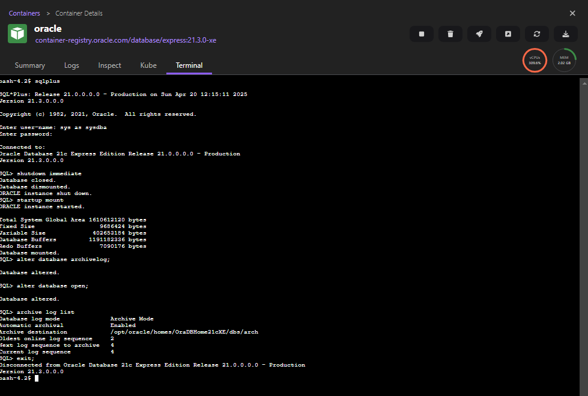

# Setup of databases for integration tests

This document describes how the databases were setup to run the integration tests. 
While following the official [debezium (3.1.0) documentation](https://debezium.io/documentation/reference/3.1/connectors/index.html) for all the supported connectors, some additions are made, f.ex. for Oracle database there exists no out-of-the-box image on Dockerhub. 
You have to build it first.


**Important Note:** Not all databases were explicitly tested as part of this integration test setup. 
The tests primarily focused on databases that include `org.antlr` as a transitive dependency. 
Additionally, one database (PostgreSQL), which does not rely on this dependency, was also tested. 
The test suite executed against PostgreSQL is intended to serve as a baseline and its successful execution suggests that the underlying data object and configurations are likely compatible with other databases as well. 


## MySQL
Server can easily be setup with an oneliner as docker / podman command:
```shell
 podman run -e MYSQL_ROOT_PASSWORD=mysql_demo --name mysql -p 3306:3306 mysql:8.0.39 --server-id=1 --log-bin=mysql-bin --binlog-format=ROW --gtid-mode=ON --enforce-gtid-consistency
```

Then run following ddl (one after another):
```sql
CREATE DATABASE `demo` /*!40100 DEFAULT CHARACTER SET utf8mb4 COLLATE utf8mb4_0900_ai_ci */ /*!80016 DEFAULT ENCRYPTION='N' */;
```
```sql
using demo;
```
```sql
CREATE TABLE `test` (
  `id` int NOT NULL AUTO_INCREMENT,
  `value` varchar(100) DEFAULT NULL,
  `timestampCol` timestamp NULL DEFAULT NULL,
  `decimalCol` decimal(6,3) DEFAULT NULL,
  PRIMARY KEY (`id`)
) ENGINE=InnoDB AUTO_INCREMENT=3 DEFAULT CHARSET=utf8mb4 COLLATE=utf8mb4_0900_ai_ci;
```
```sql
CREATE TABLE `test2` (
  `id` int NOT NULL AUTO_INCREMENT,
  `value` varchar(100) DEFAULT NULL,
  PRIMARY KEY (`id`)
) ENGINE=InnoDB AUTO_INCREMENT=2 DEFAULT CHARSET=utf8mb4 COLLATE=utf8mb4_0900_ai_ci;

```

## PostgreSQL
Server can be setup with the following docker / podman command: 
````shell
podman run -d --name postgres -p 5432:5432 -e POSTGRESQL_WAL_LEVEL=logical -e POSTGRESQL_DATABASE=test -e POSTGRESQL_POSTGRES_PASSWORD=psql_demo -e POSTGRESQL_PASSWORD=psql_demo -e POSTGRESQL_SHARED_PRELOAD_LIBRARIES=pgaudit,pgoutput bitnami/postgresql:17.4.0
````
Then run following ddl (one after another):
```sql
CREATE SCHEMA demo AUTHORIZATION postgres;
```
```sql
CREATE TABLE demo.test (
	id int GENERATED ALWAYS AS IDENTITY NOT NULL,
	value varchar NULL,
	timestampcol timestamp NULL,
	decimalcol decimal NULL,
	CONSTRAINT test_pk PRIMARY KEY (id)
);
```
```sql
ALTER USER postgres WITH REPLICATION LOGIN;
```

## MariaDB
Server can easily be setup with an oneliner as docker / podman command:
```shell
 podman run -d --name mariadb -p 3306:3306 -e MARIADB_ROOT_PASSWORD=debezium -e MARIADB_REPLICATION_MODE=master -e MARIADB_REPLICATION_USER=debezium -e MARIADB_REPLICATION_PASSWORD=debezium -e MARIADB_EXTRA_FLAGS="--log-bin=mysql-bin --binlog-format=ROW" bitnami/mariadb:11.4.5
```

Then run following ddl (one after another):
```sql
CREATE DATABASE `demo` /*!40100 DEFAULT CHARACTER SET utf8mb4 COLLATE utf8mb4_general_ci */;
```
```sql
using demo;
```
```sql
CREATE TABLE demo.test (
	id INT auto_increment NOT NULL PRIMARY KEY,
	value varchar(100) NULL,
	timestampCol TIMESTAMP NULL,
	decimalCol varchar(100) NULL
)
ENGINE=InnoDB
DEFAULT CHARSET=utf8mb4
COLLATE=utf8mb4_general_ci;
```

## Oracle
For Oracle setup, you can follow these steps:
```shell
podman run -d --name oracle -p 1521:1521 -e ORACLE_PWD=debezium container-registry.oracle.com/database/express:21.3.0-xe
```
Then connect into the container f.ex. with podman desktop and run the following command
```shell
sqlplus
```
when prompted, use `sys as sysdba` for user and `debezium` as password, then execute all the commands one after another:
```sql
shutdown immediate
startup mount
alter database archivelog;
alter database open;
-- Should now "Database log mode: Archive Mode"
archive log list
exit;
```


To enable Debezium to capture the before state of changed database rows, you must also enable supplemental logging for captured tables or for the entire database ([see Debezium wiki](https://debezium.io/documentation/reference/3.1/connectors/oracle.html#setting-up-oracle)).
For the tests you can activate minimal supplemental logging for all columns like this on a running db connection: 
```sql
ALTER DATABASE ADD SUPPLEMENTAL LOG DATA (ALL) COLUMNS;
```
Then run following ddl (one after another):
```sql
CREATE USER "C##DEMO" IDENTIFIED BY "C##DEMO";
```
```sql
CREATE TABLE C##DEMO.TEST (
    id INTEGER GENERATED BY DEFAULT ON NULL AS IDENTITY PRIMARY KEY,
    value VARCHAR2(100) NULL,
    timestampCol TIMESTAMP NULL,
    decimalCol DECIMAL NULL
);
```
```sql
ALTER USER C##DEMO QUOTA UNLIMITED ON USERS;
```